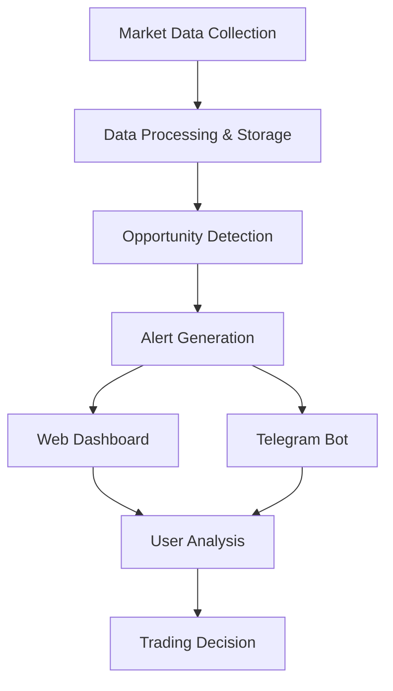

# Celebrum AI - Crypto Arbitrage & Technical Analysis Platform

## 1. Product Overview

Celebrum AI is a comprehensive crypto trading platform that identifies arbitrage opportunities across futures markets and provides advanced technical analysis tools. The platform will evolve to include AI-powered analytics and trading signals, helping traders maximize profits through automated opportunity detection and analysis.

- **Target Market**: Professional crypto traders, institutional investors, and trading firms seeking automated arbitrage and technical analysis solutions.
- **Market Value**: Addresses the $2.3 trillion crypto market with focus on futures arbitrage opportunities and technical analysis automation.

## 2. Core Features

### 2.1 User Roles

| Role | Registration Method | Core Permissions |
|------|---------------------|------------------|
| Free User | Email registration | View basic market data, limited technical analysis |
| Premium User | Subscription upgrade | Full arbitrage alerts, advanced technical analysis, telegram notifications |
| Enterprise User | Custom onboarding | API access, custom alerts, priority support |

### 2.2 Feature Module

Our crypto arbitrage platform consists of the following main components:

1. **Market Data Dashboard**: Real-time market data display, price feeds from multiple exchanges, futures contract monitoring.
2. **Arbitrage Opportunities**: Opportunity detection engine, profit calculations, risk assessment, alert system.
3. **Technical Analysis**: Chart analysis tools, indicator calculations, pattern recognition, signal generation.
4. **Alert Management**: Notification preferences, telegram integration, email alerts, webhook configurations.
5. **Portfolio Tracking**: Position monitoring, P&L tracking, performance analytics.

### 2.3 Page Details

| Page Name | Module Name | Feature description |
|-----------|-------------|---------------------|
| Market Data Dashboard | Real-time Data Feed | Display live prices from multiple exchanges, futures contract data, volume analysis |
| Market Data Dashboard | Exchange Monitoring | Track connection status, latency metrics, data quality indicators |
| Arbitrage Opportunities | Opportunity Scanner | Detect price differences across exchanges, calculate potential profits, filter by risk level |
| Arbitrage Opportunities | Alert System | Send notifications via telegram/email, customizable thresholds, opportunity ranking |
| Technical Analysis | Chart Interface | Interactive price charts, multiple timeframes, drawing tools, indicator overlays |
| Technical Analysis | Signal Generator | Generate buy/sell signals, pattern recognition, trend analysis, backtesting |
| Alert Management | Notification Center | Configure alert preferences, manage telegram bot, webhook settings |
| Portfolio Tracking | Position Monitor | Track open positions, calculate unrealized P&L, risk metrics |

## 3. Core Process

**Data Collection Flow:**
Users access the platform → System continuously collects market data from multiple exchanges → Data is processed and stored → Arbitrage opportunities are detected → Alerts are sent via telegram/web → Users can view detailed analysis and execute trades.

**Technical Analysis Flow:**
Users select trading pairs → System displays charts with technical indicators → Users configure analysis parameters → System generates signals and patterns → Results are displayed with actionable insights.

## 4. User Interface Design

### 4.1 Design Style

- **Primary Colors**: Dark theme with #1a1a1a background, #00ff88 for profits, #ff4444 for losses
- **Secondary Colors**: #333333 for cards, #666666 for borders, #ffffff for text
- **Button Style**: Rounded corners (8px), gradient backgrounds, hover animations
- **Font**: Inter font family, 14px base size, 16px for headers, 12px for small text
- **Layout Style**: Card-based design, sidebar navigation, responsive grid system
- **Icons**: Feather icons for consistency, crypto-specific icons for currencies

### 4.2 Page Design Overview

| Page Name | Module Name | UI Elements |
|-----------|-------------|-------------|
| Market Data Dashboard | Real-time Feed | Dark cards with green/red price indicators, real-time updating numbers, exchange logos |
| Market Data Dashboard | Chart Display | TradingView-style charts, dark theme, multiple timeframe tabs |
| Arbitrage Opportunities | Opportunity List | Table with sortable columns, profit percentage highlights, exchange pair indicators |
| Technical Analysis | Chart Interface | Full-screen chart view, indicator sidebar, drawing tools toolbar |
| Alert Management | Settings Panel | Toggle switches, input fields, telegram connection status |

### 4.3 Responsiveness

Desktop-first design with mobile-adaptive layouts. Touch-optimized interactions for mobile users, collapsible sidebar navigation, and responsive chart scaling.
