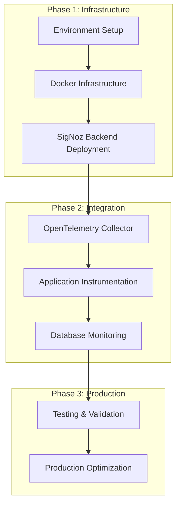

# SigNoz Deployment and Configuration Guide

## 1. Product Overview

Step-by-step deployment guide for implementing SigNoz observability stack with OpenTelemetry across the arbitrage trading application. This guide covers self-hosted SigNoz deployment, service configuration, and production-ready setup.

The deployment ensures comprehensive monitoring with minimal performance impact while maintaining existing application functionality and providing real-time observability insights.

## 2. Core Features

### 2.1 Deployment Components

| Component | Purpose | Resource Requirements |
|-----------|---------|----------------------|
| SigNoz Backend | Trace processing and storage | 2GB RAM, 10GB storage |
| ClickHouse Database | Time-series data storage | 2GB RAM, 20GB storage |
| OpenTelemetry Collector | Data aggregation and forwarding | 512MB RAM, 1GB storage |
| SigNoz Frontend | Web dashboard interface | 512MB RAM, 1GB storage |
| Redis Cache | Query result caching | 256MB RAM, 1GB storage |

### 2.2 Configuration Modules

Our deployment consists of the following configuration areas:

1. **Docker Infrastructure**: Container orchestration, network configuration, volume management
2. **OpenTelemetry Setup**: Collector configuration, instrumentation libraries, trace processing
3. **Service Integration**: Go 1.25 server setup, Node.js CCXT configuration, database monitoring
4. **Security Configuration**: Authentication setup, network security, data encryption
5. **Production Optimization**: Performance tuning, resource limits, monitoring alerts

### 2.3 Deployment Steps

| Phase | Component | Configuration Tasks |
|-------|-----------|--------------------|
| Infrastructure | Docker Setup | Create docker-compose files, configure networks, set up volumes |
| Backend Services | SigNoz Core | Deploy ClickHouse, query service, frontend dashboard |
| Data Collection | OpenTelemetry | Configure collector, set up receivers and exporters |
| Application Integration | Service Instrumentation | Add OpenTelemetry to Go server, Node.js service, databases |
| Production Setup | Monitoring & Alerts | Configure dashboards, set up alert rules, optimize performance |

## 3. Core Process

### Deployment Workflow

1. **Environment Preparation**: Set up Docker environment, create configuration directories, prepare environment variables
2. **Infrastructure Deployment**: Deploy SigNoz backend services using Docker Compose with persistent storage
3. **Collector Configuration**: Set up OpenTelemetry Collector with proper receivers, processors, and exporters
4. **Application Instrumentation**: Integrate OpenTelemetry SDKs into Go 1.25 server and Node.js CCXT service
5. **Database Monitoring**: Configure PostgreSQL and Redis monitoring with automatic instrumentation
6. **Validation and Testing**: Verify trace collection, test dashboard functionality, validate alert configurations
7. **Production Optimization**: Fine-tune performance settings, configure sampling, set up monitoring alerts

### Service Integration Flow

1. **Service Startup**: Each service initializes OpenTelemetry SDK with service-specific configuration
2. **Trace Generation**: Automatic instrumentation captures HTTP requests, database queries, and custom spans
3. **Data Export**: Services send telemetry data to OpenTelemetry Collector via OTLP protocol
4. **Data Processing**: Collector processes, enriches, and forwards data to SigNoz backend
5. **Storage and Indexing**: ClickHouse stores trace data with proper indexing for fast queries
6. **Dashboard Visualization**: SigNoz frontend provides real-time visualization and analysis tools



## 4. Environment Configuration

### 4.1 Directory Structure

```
project-root/
├── observability/
│   ├── docker-compose.signoz.yml
│   ├── config/
│   │   ├── otel-collector-config.yaml
│   │   ├── prometheus.yml
│   │   └── nginx.conf
│   ├── data/
│   │   ├── clickhouse/
│   │   └── redis/
│   └── scripts/
│       ├── deploy.sh
│       ├── health-check.sh
│       └── cleanup.sh
├── .env.observability
└── Makefile
```

### 4.2 Environment Variables

```bash
# .env.observability

# SigNoz Configuration
SIGNOZ_VERSION=0.39.0
CLICKHOUSE_VERSION=23.8-alpine
OTEL_COLLECTOR_VERSION=0.88.11

# Network Configuration
SIGNOZ_FRONTEND_PORT=3301
CLICKHOUSE_HTTP_PORT=8123
CLICKHOUSE_NATIVE_PORT=9000
OTEL_GRPC_PORT=4317
OTEL_HTTP_PORT=4318

# Storage Configuration
CLICKHOUSE_DATA_PATH=./data/clickhouse
REDIS_DATA_PATH=./data/redis

# OpenTelemetry Configuration
OTEL_SERVICE_NAME=arbitrage-app
OTEL_ENVIRONMENT=production
OTEL_COLLECTOR_ENDPOINT=http://localhost:4318

# Resource Limits
CLICKHOUSE_MEMORY_LIMIT=2g
QUERY_SERVICE_MEMORY_LIMIT=1g
FRONTEND_MEMORY_LIMIT=512m
COLLECTOR_MEMORY_LIMIT=512m

# Security Configuration
CLICKHOUSE_USER=default
CLICKHOUSE_PASSWORD=
SIGNOZ_ADMIN_USER=admin
SIGNOZ_ADMIN_PASSWORD=admin123
```

### 4.3 Docker Compose Configuration

```yaml
# docker-compose.signoz.yml
version: '3.8'

services:
  clickhouse:
    image: clickhouse/clickhouse-server:${CLICKHOUSE_VERSION:-23.8-alpine}
    container_name: signoz-clickhouse
    hostname: clickhouse
    ports:
      - "${CLICKHOUSE_NATIVE_PORT:-9000}:9000"
      - "${CLICKHOUSE_HTTP_PORT:-8123}:8123"
    volumes:
      - ${CLICKHOUSE_DATA_PATH:-./data/clickhouse}:/var/lib/clickhouse/
      - ./config/clickhouse-config.xml:/etc/clickhouse-server/config.xml
    environment:
      - CLICKHOUSE_DB=signoz_traces
      - CLICKHOUSE_USER=${CLICKHOUSE_USER:-default}
      - CLICKHOUSE_PASSWORD=${CLICKHOUSE_PASSWORD:-}
    mem_limit: ${CLICKHOUSE_MEMORY_LIMIT:-2g}
    restart: unless-stopped
    healthcheck:
      test: ["CMD", "wget", "--no-verbose", "--tries=1", "--spider", "http://localhost:8123/ping"]
      interval: 30s
      timeout: 5s
      retries: 3

  query-service:
    image: signoz/query-service:${SIGNOZ_VERSION:-0.39.0}
    container_name: signoz-query-service
    command: ["-config=/root/config/prometheus.yml"]
    volumes:
      - ./config/prometheus.yml:/root/config/prometheus.yml
    environment:
      - ClickHouseUrl=tcp://clickhouse:9000
      - STORAGE=clickhouse
      - GODEBUG=netdns=go
    ports:
      - "6060:6060"
      - "8080:8080"
    mem_limit: ${QUERY_SERVICE_MEMORY_LIMIT:-1g}
    restart: unless-stopped
    depends_on:
      clickhouse:
        condition: service_healthy
    healthcheck:
      test: ["CMD", "wget", "--no-verbose", "--tries=1", "--spider", "http://localhost:8080/api/v1/health"]
      interval: 30s
      timeout: 5s
      retries: 3

  frontend:
    image: signoz/frontend:${SIGNOZ_VERSION:-0.39.0}
    container_name: signoz-frontend
    ports:
      - "${SIGNOZ_FRONTEND_PORT:-3301}:3301"
    volumes:
      - ./config/nginx.conf:/etc/nginx/nginx.conf
    environment:
      - FRONTEND_API_ENDPOINT=http://query-service:8080
    mem_limit: ${FRONTEND_MEMORY_LIMIT:-512m}
    restart: unless-stopped
    depends_on:
      query-service:
        condition: service_healthy

  otel-collector:
    image: signoz/signoz-otel-collector:${OTEL_COLLECTOR_VERSION:-0.88.11}
    container_name: signoz-otel-collector
    command: ["--config=/etc/otelcol-contrib/otel-collector-config.yaml"]
    volumes:
      - ./config/otel-collector-config.yaml:/etc/otelcol-contrib/otel-collector-config.yaml
    ports:
      - "${OTEL_GRPC_PORT:-4317}:4317"   # OTLP gRPC receiver
      - "${OTEL_HTTP_PORT:-4318}:4318"   # OTLP HTTP receiver
      - "8888:8888"   # Prometheus metrics
      - "13133:13133" # Health check
    mem_limit: ${COLLECTOR_MEMORY_LIMIT:-512m}
    restart: unless-stopped
    depends_on:
      query-service:
        condition: service_healthy
    healthcheck:
      test: ["CMD", "wget", "--no-verbose", "--tries=1", "--spider", "http://localhost:13133"]
      interval: 30s
      timeout: 5s
      retries: 3

  redis:
    image: redis:7-alpine
    container_name: signoz-redis
    ports:
      - "6379:6379"
    volumes:
      - ${REDIS_DATA_PATH:-./data/redis}:/data
    command: redis-server --appendonly yes
    mem_limit: 256m
    restart: unless-stopped
    healthcheck:
      test: ["CMD", "redis-cli", "ping"]
      interval: 30s
      timeout: 5s
      retries: 3

networks:
  default:
    name: signoz-network
    driver: bridge

volumes:
  clickhouse-data:
    driver: local
  redis-data:
    driver: local
```

## 5. Deployment Scripts

### 5.1 Main Deployment Script

```bash
#!/bin/bash
# scripts/deploy.sh

set -e

echo "🚀 Starting SigNoz deployment..."

# Load environment variables
if [ -f .env.observability ]; then
    source .env.observability
    echo "✅ Environment variables loaded"
else
    echo "❌ .env.observability file not found"
    exit 1
fi

# Create necessary directories
echo "📁 Creating data directories..."
mkdir -p data/clickhouse data/redis config

# Check Docker and Docker Compose
if ! command -v docker &> /dev/null; then
    echo "❌ Docker is not installed"
    exit 1
fi

if ! command -v docker-compose &> /dev/null; then
    echo "❌ Docker Compose is not installed"
    exit 1
fi

# Pull latest images
echo "📥 Pulling Docker images..."
docker-compose -f docker-compose.signoz.yml pull

# Start services
echo "🔄 Starting SigNoz services..."
docker-compose -f docker-compose.signoz.yml up -d

# Wait for services to be healthy
echo "⏳ Waiting for services to be healthy..."
sleep 30

# Health check
echo "🏥 Performing health checks..."
./scripts/health-check.sh

echo "✅ SigNoz deployment completed successfully!"
echo "🌐 Dashboard available at: http://localhost:${SIGNOZ_FRONTEND_PORT:-3301}"
echo "📊 Collector endpoints:"
echo "   - OTLP gRPC: localhost:${OTEL_GRPC_PORT:-4317}"
echo "   - OTLP HTTP: localhost:${OTEL_HTTP_PORT:-4318}"
```

### 5.2 Health Check Script

```bash
#!/bin/bash
# scripts/health-check.sh

set -e

echo "🏥 Checking SigNoz service health..."

# Load environment variables
source .env.observability

# Check ClickHouse
echo "Checking ClickHouse..."
if curl -f http://localhost:${CLICKHOUSE_HTTP_PORT:-8123}/ping > /dev/null 2>&1; then
    echo "✅ ClickHouse is healthy"
else
    echo "❌ ClickHouse is not responding"
    exit 1
fi

# Check Query Service
echo "Checking Query Service..."
if curl -f http://localhost:8080/api/v1/health > /dev/null 2>&1; then
    echo "✅ Query Service is healthy"
else
    echo "❌ Query Service is not responding"
    exit 1
fi

# Check Frontend
echo "Checking Frontend..."
if curl -f http://localhost:${SIGNOZ_FRONTEND_PORT:-3301} > /dev/null 2>&1; then
    echo "✅ Frontend is healthy"
else
    echo "❌ Frontend is not responding"
    exit 1
fi

# Check OpenTelemetry Collector
echo "Checking OpenTelemetry Collector..."
if curl -f http://localhost:13133 > /dev/null 2>&1; then
    echo "✅ OpenTelemetry Collector is healthy"
else
    echo "❌ OpenTelemetry Collector is not responding"
    exit 1
fi

# Check Redis
echo "Checking Redis..."
if docker exec signoz-redis redis-cli ping | grep -q PONG; then
    echo "✅ Redis is healthy"
else
    echo "❌ Redis is not responding"
    exit 1
fi

echo "🎉 All services are healthy!"
```

### 5.3 Makefile Integration

```makefile
# Makefile additions for observability

.PHONY: observability-deploy observability-stop observability-logs observability-health

observability-deploy:
	@echo "Deploying SigNoz observability stack..."
	@chmod +x observability/scripts/deploy.sh
	@cd observability && ./scripts/deploy.sh

observability-stop:
	@echo "Stopping SigNoz services..."
	@cd observability && docker-compose -f docker-compose.signoz.yml down

observability-logs:
	@echo "Showing SigNoz service logs..."
	@cd observability && docker-compose -f docker-compose.signoz.yml logs -f

observability-health:
	@echo "Checking SigNoz service health..."
	@chmod +x observability/scripts/health-check.sh
	@cd observability && ./scripts/health-check.sh

observability-clean:
	@echo "Cleaning up SigNoz deployment..."
	@cd observability && docker-compose -f docker-compose.signoz.yml down -v
	@cd observability && docker system prune -f
```

## 6. Production Considerations

### 6.1 Resource Optimization

- **Memory Limits**: Set appropriate memory limits for each service based on load
- **Storage Management**: Configure log rotation and data retention policies
- **Network Security**: Use internal Docker networks and secure external access
- **Backup Strategy**: Implement regular backups for ClickHouse data

### 6.2 Monitoring and Alerts

- **Service Health**: Monitor container health and restart policies
- **Resource Usage**: Track CPU, memory, and disk usage across all services
- **Data Ingestion**: Monitor trace ingestion rates and processing latency
- **Alert Configuration**: Set up alerts for service failures and performance degradation

### 6.3 Security Configuration

- **Authentication**: Configure proper authentication for SigNoz dashboard
- **Network Isolation**: Use Docker networks to isolate observability stack
- **Data Encryption**: Enable encryption for data in transit and at rest
- **Access Control**: Implement role-based access control for different user types

This deployment guide ensures a robust, scalable, and secure SigNoz observability implementation for the arbitrage trading application.