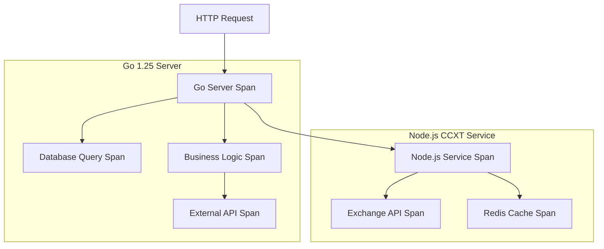

# SigNoz OpenTelemetry Instrumentation Guide

## 1. Product Overview

Comprehensive instrumentation guide for integrating OpenTelemetry with Go 1.25 server, Node.js CCXT service, PostgreSQL, and Redis components. This guide provides detailed code examples, best practices, and troubleshooting steps for complete observability coverage.

The instrumentation ensures automatic trace generation, custom span creation, error tracking, and performance monitoring across all application components while maintaining minimal performance overhead.

## 2. Core Features

### 2.1 Instrumentation Coverage

| Service | Instrumentation Type | Coverage Areas |
|---------|---------------------|----------------|
| Go 1.25 Server | Manual + Auto | HTTP handlers, database queries, business logic, external APIs |
| Node.js CCXT Service | Auto + Custom | Express routes, exchange APIs, data processing, error handling |
| PostgreSQL | Auto | Query execution, connection pooling, transaction tracking |
| Redis | Auto | Command execution, connection monitoring, cache operations |
| Nginx | Log-based | Request logging, response times, error rates |

### 2.2 Telemetry Components

Our instrumentation implementation includes:

1. **Trace Generation**: Automatic span creation for HTTP requests, database operations, external API calls
2. **Custom Spans**: Business logic tracing, arbitrage detection, signal processing, opportunity analysis
3. **Error Tracking**: Exception capture, error context enrichment, failure correlation
4. **Metrics Collection**: Performance counters, business metrics, resource utilization
5. **Log Correlation**: Structured logging with trace context, error aggregation

### 2.3 Implementation Modules

| Module | Component | Implementation Details |
|--------|-----------|------------------------|
| Go Server | HTTP Instrumentation | Automatic request/response tracing, middleware integration |
| Go Server | Database Tracing | SQL query spans, connection pool monitoring |
| Go Server | Custom Business Logic | Arbitrage detection spans, signal processing traces |
| Node.js Service | Auto-instrumentation | Express, HTTP client, file system operations |
| Node.js Service | Exchange API Tracing | CCXT library instrumentation, API call monitoring |
| Database Layer | PostgreSQL Monitoring | Query performance, slow query detection |
| Cache Layer | Redis Monitoring | Command tracing, connection health, performance metrics |

## 3. Core Process

### Instrumentation Workflow

1. **SDK Initialization**: Each service initializes OpenTelemetry SDK with service-specific configuration and resource attributes
2. **Automatic Instrumentation**: Libraries automatically create spans for HTTP requests, database queries, and external API calls
3. **Custom Span Creation**: Business logic creates custom spans for domain-specific operations like arbitrage detection
4. **Context Propagation**: Trace context propagates across service boundaries and asynchronous operations
5. **Data Export**: Telemetry data exports to OpenTelemetry Collector via OTLP protocol
6. **Error Enrichment**: Errors automatically capture stack traces, context, and correlation information

### Trace Context Flow

1. **Request Initiation**: HTTP request starts root span with trace ID and initial context
2. **Service Processing**: Each service operation creates child spans with proper parent-child relationships
3. **Database Operations**: Database queries create spans with SQL statements and execution metrics
4. **External API Calls**: HTTP client calls create spans with request/response details
5. **Business Logic**: Custom spans track domain-specific operations with relevant attributes
6. **Response Generation**: Final span completes with response status and performance metrics



## 4. Go 1.25 Server Instrumentation

### 4.1 OpenTelemetry Setup

```go
// internal/telemetry/tracer.go
package telemetry

import (
    "context"
    "fmt"
    "log"
    "os"
    "time"
    
    "go.opentelemetry.io/otel"
    "go.opentelemetry.io/otel/attribute"
    "go.opentelemetry.io/otel/exporters/otlp/otlptrace/otlptracehttp"
    "go.opentelemetry.io/otel/propagation"
    "go.opentelemetry.io/otel/sdk/resource"
    "go.opentelemetry.io/otel/sdk/trace"
    "go.opentelemetry.io/otel/semconv/v1.21.0"
)

type Config struct {
    ServiceName     string
    ServiceVersion  string
    Environment     string
    CollectorURL    string
    SampleRate      float64
}

func InitTracer(config Config) (*trace.TracerProvider, error) {
    // Create OTLP HTTP exporter
    exporter, err := otlptracehttp.New(
        context.Background(),
        otlptracehttp.WithEndpoint(config.CollectorURL),
        otlptracehttp.WithInsecure(), // Use WithTLSClientConfig for production
        otlptracehttp.WithHeaders(map[string]string{
            "Content-Type": "application/json",
        }),
        otlptracehttp.WithTimeout(30*time.Second),
    )
    if err != nil {
        return nil, fmt.Errorf("failed to create OTLP exporter: %w", err)
    }

    // Create resource with service information
    resource := resource.NewWithAttributes(
        semconv.SchemaURL,
        semconv.ServiceName(config.ServiceName),
        semconv.ServiceVersion(config.ServiceVersion),
        semconv.DeploymentEnvironment(config.Environment),
        attribute.String("service.instance.id", getInstanceID()),
    )

    // Configure sampling strategy
    var sampler trace.Sampler
    if config.SampleRate >= 1.0 {
        sampler = trace.AlwaysSample()
    } else if config.SampleRate <= 0.0 {
        sampler = trace.NeverSample()
    } else {
        sampler = trace.TraceIDRatioBased(config.SampleRate)
    }

    // Create tracer provider
    tp := trace.NewTracerProvider(
        trace.WithBatcher(exporter,
            trace.WithBatchTimeout(5*time.Second),
            trace.WithMaxExportBatchSize(512),
        ),
        trace.WithResource(resource),
        trace.WithSampler(sampler),
    )

    // Set global tracer provider and propagator
    otel.SetTracerProvider(tp)
    otel.SetTextMapPropagator(propagation.NewCompositeTextMapPropagator(
        propagation.TraceContext{},
        propagation.Baggage{},
    ))

    return tp, nil
}

func getInstanceID() string {
    if id := os.Getenv("INSTANCE_ID"); id != "" {
        return id
    }
    hostname, _ := os.Hostname()
    return hostname
}
```

### 4.2 HTTP Middleware Instrumentation

```go
// internal/middleware/tracing.go
package middleware

import (
    "net/http"
    "strconv"
    "time"
    
    "go.opentelemetry.io/contrib/instrumentation/net/http/otelhttp"
    "go.opentelemetry.io/otel"
    "go.opentelemetry.io/otel/attribute"
    "go.opentelemetry.io/otel/codes"
    "go.opentelemetry.io/otel/trace"
)

var tracer = otel.Tracer("arbitrage-server")

// TracingMiddleware wraps HTTP handlers with OpenTelemetry tracing
func TracingMiddleware(next http.Handler) http.Handler {
    return otelhttp.NewHandler(next, "http-server",
        otelhttp.WithMessageEvents(otelhttp.ReadEvents, otelhttp.WriteEvents),
        otelhttp.WithSpanOptions(trace.WithAttributes(
            attribute.String("component", "http-server"),
        )),
    )
}

// CustomSpanMiddleware adds custom attributes to spans
func CustomSpanMiddleware(next http.Handler) http.Handler {
    return http.HandlerFunc(func(w http.ResponseWriter, r *http.Request) {
        span := trace.SpanFromContext(r.Context())
        
        // Add custom attributes
        span.SetAttributes(
            attribute.String("http.user_agent", r.UserAgent()),
            attribute.String("http.remote_addr", r.RemoteAddr),
            attribute.Int64("http.request_content_length", r.ContentLength),
        )
        
        // Wrap response writer to capture response details
        wrapped := &responseWriter{ResponseWriter: w, statusCode: 200}
        
        start := time.Now()
        next.ServeHTTP(wrapped, r)
        duration := time.Since(start)
        
        // Add response attributes
        span.SetAttributes(
            attribute.Int("http.status_code", wrapped.statusCode),
            attribute.Int64("http.response_size", wrapped.bytesWritten),
            attribute.Float64("http.duration_ms", float64(duration.Nanoseconds())/1e6),
        )
        
        // Set span status based on HTTP status code
        if wrapped.statusCode >= 400 {
            span.SetStatus(codes.Error, http.StatusText(wrapped.statusCode))
        }
    })
}

type responseWriter struct {
    http.ResponseWriter
    statusCode   int
    bytesWritten int64
}

func (rw *responseWriter) WriteHeader(code int) {
    rw.statusCode = code
    rw.ResponseWriter.WriteHeader(code)
}

func (rw *responseWriter) Write(b []byte) (int, error) {
    n, err := rw.ResponseWriter.Write(b)
    rw.bytesWritten += int64(n)
    return n, err
}
```

### 4.3 Database Instrumentation

```go
// internal/database/instrumented.go
package database

import (
    "context"
    "database/sql"
    "fmt"
    "time"
    
    "go.opentelemetry.io/contrib/instrumentation/database/sql/otelsql"
    "go.opentelemetry.io/otel"
    "go.opentelemetry.io/otel/attribute"
    "go.opentelemetry.io/otel/codes"
    "go.opentelemetry.io/otel/semconv/v1.21.0"
    "go.opentelemetry.io/otel/trace"
    
    _ "github.com/lib/pq" // PostgreSQL driver
)

var tracer = otel.Tracer("database")

type DB struct {
    *sql.DB
}

func NewDB(dsn string) (*DB, error) {
    // Register the otelsql wrapper for the postgres driver
    db, err := otelsql.Open("postgres", dsn,
        otelsql.WithAttributes(
            semconv.DBSystemPostgreSQL,
        ),
        otelsql.WithSpanOptions(trace.WithAttributes(
            attribute.String("component", "database"),
        )),
    )
    if err != nil {
        return nil, fmt.Errorf("failed to open database: %w", err)
    }

    // Configure connection pool
    db.SetMaxOpenConns(25)
    db.SetMaxIdleConns(5)
    db.SetConnMaxLifetime(5 * time.Minute)

    // Test connection
    if err := db.Ping(); err != nil {
        return nil, fmt.Errorf("failed to ping database: %w", err)
    }

    return &DB{DB: db}, nil
}

// QueryWithTracing executes a query with custom tracing
func (db *DB) QueryWithTracing(ctx context.Context, query string, args ...interface{}) (*sql.Rows, error) {
    ctx, span := tracer.Start(ctx, "db.query",
        trace.WithAttributes(
            attribute.String("db.statement", query),
            attribute.Int("db.args.count", len(args)),
        ),
    )
    defer span.End()

    start := time.Now()
    rows, err := db.QueryContext(ctx, query, args...)
    duration := time.Since(start)

    span.SetAttributes(
        attribute.Float64("db.duration_ms", float64(duration.Nanoseconds())/1e6),
    )

    if err != nil {
        span.RecordError(err)
        span.SetStatus(codes.Error, err.Error())
        return nil, err
    }

    return rows, nil
}

// ExecWithTracing executes a statement with custom tracing
func (db *DB) ExecWithTracing(ctx context.Context, query string, args ...interface{}) (sql.Result, error) {
    ctx, span := tracer.Start(ctx, "db.exec",
        trace.WithAttributes(
            attribute.String("db.statement", query),
            attribute.Int("db.args.count", len(args)),
        ),
    )
    defer span.End()

    start := time.Now()
    result, err := db.ExecContext(ctx, query, args...)
    duration := time.Since(start)

    span.SetAttributes(
        attribute.Float64("db.duration_ms", float64(duration.Nanoseconds())/1e6),
    )

    if err != nil {
        span.RecordError(err)
        span.SetStatus(codes.Error, err.Error())
        return nil, err
    }

    // Add result information if available
    if rowsAffected, err := result.RowsAffected(); err == nil {
        span.SetAttributes(attribute.Int64("db.rows_affected", rowsAffected))
    }

    return result, nil
}
```

### 4.4 Business Logic Instrumentation

```go
// internal/arbitrage/service.go
package arbitrage

import (
    "context"
    "fmt"
    "time"
    
    "go.opentelemetry.io/otel"
    "go.opentelemetry.io/otel/attribute"
    "go.opentelemetry.io/otel/codes"
    "go.opentelemetry.io/otel/trace"
)

var tracer = otel.Tracer("arbitrage-service")

type Service struct {
    db     *database.DB
    redis  *redis.Client
    ccxt   *ccxt.Client
}

type Opportunity struct {
    ID          string    `json:"id"`
    Symbol      string    `json:"symbol"`
    BuyExchange string    `json:"buy_exchange"`
    SellExchange string   `json:"sell_exchange"`
    BuyPrice    float64   `json:"buy_price"`
    SellPrice   float64   `json:"sell_price"`
    Profit      float64   `json:"profit"`
    ProfitPct   float64   `json:"profit_pct"`
    CreatedAt   time.Time `json:"created_at"`
}

// DetectOpportunities finds arbitrage opportunities across exchanges
func (s *Service) DetectOpportunities(ctx context.Context, symbols []string) ([]Opportunity, error) {
    ctx, span := tracer.Start(ctx, "arbitrage.detect_opportunities",
        trace.WithAttributes(
            attribute.StringSlice("symbols", symbols),
            attribute.Int("symbols.count", len(symbols)),
        ),
    )
    defer span.End()

    var allOpportunities []Opportunity
    
    for _, symbol := range symbols {
        opportunities, err := s.detectSymbolOpportunities(ctx, symbol)
        if err != nil {
            span.RecordError(err)
            span.SetAttributes(attribute.String("error.symbol", symbol))
            continue
        }
        allOpportunities = append(allOpportunities, opportunities...)
    }

    span.SetAttributes(
        attribute.Int("opportunities.found", len(allOpportunities)),
        attribute.Float64("opportunities.avg_profit", calculateAvgProfit(allOpportunities)),
    )

    return allOpportunities, nil
}

func (s *Service) detectSymbolOpportunities(ctx context.Context, symbol string) ([]Opportunity, error) {
    ctx, span := tracer.Start(ctx, "arbitrage.detect_symbol_opportunities",
        trace.WithAttributes(
            attribute.String("symbol", symbol),
        ),
    )
    defer span.End()

    // Fetch market data from exchanges
    marketData, err := s.fetchMarketData(ctx, symbol)
    if err != nil {
        span.RecordError(err)
        span.SetStatus(codes.Error, fmt.Sprintf("failed to fetch market data: %v", err))
        return nil, err
    }

    span.SetAttributes(
        attribute.Int("exchanges.count", len(marketData)),
    )

    // Analyze arbitrage opportunities
    opportunities := s.analyzeArbitrage(ctx, symbol, marketData)
    
    // Store opportunities in database
    if len(opportunities) > 0 {
        if err := s.storeOpportunities(ctx, opportunities); err != nil {
            span.RecordError(err)
            // Don't fail the entire operation for storage errors
        }
    }

    span.SetAttributes(
        attribute.Int("opportunities.symbol.count", len(opportunities)),
    )

    return opportunities, nil
}

func (s *Service) fetchMarketData(ctx context.Context, symbol string) (map[string]MarketData, error) {
    ctx, span := tracer.Start(ctx, "arbitrage.fetch_market_data",
        trace.WithAttributes(
            attribute.String("symbol", symbol),
        ),
    )
    defer span.End()

    // Check cache first
    if cached, err := s.getCachedMarketData(ctx, symbol); err == nil {
        span.SetAttributes(attribute.Bool("cache.hit", true))
        return cached, nil
    }
    span.SetAttributes(attribute.Bool("cache.hit", false))

    // Fetch from CCXT service
    marketData, err := s.ccxt.GetMarketData(ctx, symbol)
    if err != nil {
        span.RecordError(err)
        span.SetStatus(codes.Error, fmt.Sprintf("failed to fetch from CCXT: %v", err))
        return nil, err
    }

    // Cache the result
    if err := s.cacheMarketData(ctx, symbol, marketData); err != nil {
        span.RecordError(err)
        // Don't fail for cache errors
    }

    return marketData, nil
}

func calculateAvgProfit(opportunities []Opportunity) float64 {
    if len(opportunities) == 0 {
        return 0
    }
    
    total := 0.0
    for _, opp := range opportunities {
        total += opp.Profit
    }
    return total / float64(len(opportunities))
}
```

## 5. Node.js CCXT Service Instrumentation

### 5.1 OpenTelemetry Setup

```javascript
// instrumentation.js
const { NodeSDK } = require('@opentelemetry/sdk-node');
const { getNodeAutoInstrumentations } = require('@opentelemetry/auto-instrumentations-node');
const { OTLPTraceExporter } = require('@opentelemetry/exporter-otlp-http');
const { Resource } = require('@opentelemetry/resources');
const { SemanticResourceAttributes } = require('@opentelemetry/semantic-conventions');
const { BatchSpanProcessor } = require('@opentelemetry/sdk-trace-base');
const { AlwaysOnSampler, TraceIdRatioBasedSampler } = require('@opentelemetry/sdk-trace-base');

// Initialize OpenTelemetry SDK
const sdk = new NodeSDK({
  resource: new Resource({
    [SemanticResourceAttributes.SERVICE_NAME]: 'ccxt-service',
    [SemanticResourceAttributes.SERVICE_VERSION]: '1.0.0',
    [SemanticResourceAttributes.DEPLOYMENT_ENVIRONMENT]: process.env.NODE_ENV || 'development',
    [SemanticResourceAttributes.SERVICE_INSTANCE_ID]: process.env.INSTANCE_ID || require('os').hostname(),
  }),
  
  traceExporter: new OTLPTraceExporter({
    url: process.env.OTEL_EXPORTER_OTLP_TRACES_ENDPOINT || 'http://localhost:4318/v1/traces',
    headers: {
      'Content-Type': 'application/json',
    },
  }),
  
  instrumentations: [
    getNodeAutoInstrumentations({
      '@opentelemetry/instrumentation-fs': {
        enabled: false, // Disable file system instrumentation for performance
      },
      '@opentelemetry/instrumentation-http': {
        enabled: true,
        requestHook: (span, request) => {
          span.setAttributes({
            'http.request.header.user-agent': request.getHeader('user-agent'),
            'http.request.header.content-type': request.getHeader('content-type'),
          });
        },
        responseHook: (span, response) => {
          span.setAttributes({
            'http.response.header.content-type': response.getHeader('content-type'),
          });
        },
      },
      '@opentelemetry/instrumentation-express': {
        enabled: true,
      },
      '@opentelemetry/instrumentation-redis': {
        enabled: true,
      },
    }),
  ],
  
  sampler: process.env.OTEL_SAMPLE_RATE 
    ? new TraceIdRatioBasedSampler(parseFloat(process.env.OTEL_SAMPLE_RATE))
    : new AlwaysOnSampler(),
});

// Start the SDK
sdk.start();

console.log('OpenTelemetry started successfully');

// Graceful shutdown
process.on('SIGTERM', () => {
  sdk.shutdown()
    .then(() => console.log('OpenTelemetry terminated'))
    .catch((error) => console.log('Error terminating OpenTelemetry', error))
    .finally(() => process.exit(0));
});
```

### 5.2 Express Application with Custom Tracing

```javascript
// app.js
require('./instrumentation'); // Must be first import

const express = require('express');
const { trace, context, SpanStatusCode } = require('@opentelemetry/api');
const ccxt = require('ccxt');
const Redis = require('redis');

const app = express();
const tracer = trace.getTracer('ccxt-service');

// Redis client
const redis = Redis.createClient({
  url: process.env.REDIS_URL || 'redis://localhost:6379'
});

// Initialize exchanges
const exchanges = {
  binance: new ccxt.binance({ sandbox: false }),
  coinbase: new ccxt.coinbasepro({ sandbox: false }),
  kraken: new ccxt.kraken({ sandbox: false }),
};

// Middleware for request logging
app.use((req, res, next) => {
  const span = trace.getActiveSpan();
  if (span) {
    span.setAttributes({
      'http.route': req.route?.path || req.path,
      'http.user_agent': req.get('User-Agent'),
      'http.request_id': req.get('X-Request-ID') || generateRequestId(),
    });
  }
  next();
});

// Get market data for a symbol across all exchanges
app.get('/api/market-data/:symbol', async (req, res) => {
  const { symbol } = req.params;
  
  const span = tracer.startSpan('ccxt.get_market_data', {
    attributes: {
      'symbol': symbol,
      'operation': 'get_market_data',
    },
  });
  
  try {
    const marketData = await context.with(trace.setSpan(context.active(), span), async () => {
      return await fetchMarketDataForSymbol(symbol);
    });
    
    span.setAttributes({
      'exchanges.count': Object.keys(marketData).length,
      'success': true,
    });
    
    res.json({
      symbol,
      data: marketData,
      timestamp: new Date().toISOString(),
    });
  } catch (error) {
    span.recordException(error);
    span.setStatus({ code: SpanStatusCode.ERROR, message: error.message });
    
    res.status(500).json({
      error: 'Failed to fetch market data',
      message: error.message,
    });
  } finally {
    span.end();
  }
});

// Fetch ticker data for all exchanges
app.get('/api/tickers/:symbol', async (req, res) => {
  const { symbol } = req.params;
  
  const span = tracer.startSpan('ccxt.get_tickers', {
    attributes: {
      'symbol': symbol,
      'operation': 'get_tickers',
    },
  });
  
  try {
    const tickers = await context.with(trace.setSpan(context.active(), span), async () => {
      return await fetchTickersForSymbol(symbol);
    });
    
    span.setAttributes({
      'tickers.count': Object.keys(tickers).length,
      'success': true,
    });
    
    res.json({
      symbol,
      tickers,
      timestamp: new Date().toISOString(),
    });
  } catch (error) {
    span.recordException(error);
    span.setStatus({ code: SpanStatusCode.ERROR, message: error.message });
    
    res.status(500).json({
      error: 'Failed to fetch tickers',
      message: error.message,
    });
  } finally {
    span.end();
  }
});

// Helper function to fetch market data
async function fetchMarketDataForSymbol(symbol) {
  const span = tracer.startSpan('ccxt.fetch_market_data_parallel', {
    attributes: {
      'symbol': symbol,
      'exchanges.total': Object.keys(exchanges).length,
    },
  });
  
  try {
    // Check cache first
    const cacheKey = `market_data:${symbol}`;
    const cached = await redis.get(cacheKey);
    
    if (cached) {
      span.setAttributes({ 'cache.hit': true });
      return JSON.parse(cached);
    }
    
    span.setAttributes({ 'cache.hit': false });
    
    // Fetch from all exchanges in parallel
    const promises = Object.entries(exchanges).map(([name, exchange]) => 
      fetchExchangeData(name, exchange, symbol)
    );
    
    const results = await Promise.allSettled(promises);
    const marketData = {};
    
    results.forEach((result, index) => {
      const exchangeName = Object.keys(exchanges)[index];
      if (result.status === 'fulfilled') {
        marketData[exchangeName] = result.value;
      } else {
        span.recordException(result.reason);
        console.error(`Failed to fetch data from ${exchangeName}:`, result.reason);
      }
    });
    
    // Cache the result for 30 seconds
    await redis.setex(cacheKey, 30, JSON.stringify(marketData));
    
    span.setAttributes({
      'exchanges.successful': Object.keys(marketData).length,
      'exchanges.failed': Object.keys(exchanges).length - Object.keys(marketData).length,
    });
    
    return marketData;
  } finally {
    span.end();
  }
}

// Helper function to fetch data from a single exchange
async function fetchExchangeData(exchangeName, exchange, symbol) {
  const span = tracer.startSpan('ccxt.fetch_exchange_data', {
    attributes: {
      'exchange.name': exchangeName,
      'symbol': symbol,
    },
  });
  
  try {
    const startTime = Date.now();
    
    // Fetch ticker data
    const ticker = await exchange.fetchTicker(symbol);
    
    const duration = Date.now() - startTime;
    
    span.setAttributes({
      'exchange.response_time_ms': duration,
      'ticker.bid': ticker.bid,
      'ticker.ask': ticker.ask,
      'ticker.last': ticker.last,
      'ticker.volume': ticker.baseVolume,
      'success': true,
    });
    
    return {
      exchange: exchangeName,
      symbol: ticker.symbol,
      bid: ticker.bid,
      ask: ticker.ask,
      last: ticker.last,
      volume: ticker.baseVolume,
      timestamp: ticker.timestamp,
      responseTime: duration,
    };
  } catch (error) {
    span.recordException(error);
    span.setStatus({ code: SpanStatusCode.ERROR, message: error.message });
    throw error;
  } finally {
    span.end();
  }
}

// Helper function to fetch tickers
async function fetchTickersForSymbol(symbol) {
  const span = tracer.startSpan('ccxt.fetch_tickers_parallel', {
    attributes: {
      'symbol': symbol,
    },
  });
  
  try {
    const promises = Object.entries(exchanges).map(async ([name, exchange]) => {
      try {
        const ticker = await exchange.fetchTicker(symbol);
        return [name, ticker];
      } catch (error) {
        span.recordException(error);
        return [name, null];
      }
    });
    
    const results = await Promise.all(promises);
    const tickers = Object.fromEntries(results.filter(([, ticker]) => ticker !== null));
    
    span.setAttributes({
      'tickers.successful': Object.keys(tickers).length,
      'tickers.failed': results.length - Object.keys(tickers).length,
    });
    
    return tickers;
  } finally {
    span.end();
  }
}

function generateRequestId() {
  return Math.random().toString(36).substring(2, 15) + Math.random().toString(36).substring(2, 15);
}

// Error handling middleware
app.use((error, req, res, next) => {
  const span = trace.getActiveSpan();
  if (span) {
    span.recordException(error);
    span.setStatus({ code: SpanStatusCode.ERROR, message: error.message });
  }
  
  console.error('Unhandled error:', error);
  res.status(500).json({
    error: 'Internal server error',
    message: error.message,
  });
});

const PORT = process.env.PORT || 3000;
app.listen(PORT, () => {
  console.log(`CCXT service listening on port ${PORT}`);
});

module.exports = app;
```

## 6. Redis Instrumentation

### 6.1 Go Redis Client

```go
// internal/cache/redis.go
package cache

import (
    "context"
    "encoding/json"
    "time"
    
    "github.com/go-redis/redis/v8"
    "github.com/go-redis/redis/extra/redisotel/v8"
    "go.opentelemetry.io/otel"
    "go.opentelemetry.io/otel/attribute"
    "go.opentelemetry.io/otel/trace"
)

var tracer = otel.Tracer("redis-cache")

type Client struct {
    rdb *redis.Client
}

func NewClient(addr, password string, db int) *Client {
    rdb := redis.NewClient(&redis.Options{
        Addr:     addr,
        Password: password,
        DB:       db,
        PoolSize: 10,
        MinIdleConns: 5,
    })
    
    // Add OpenTelemetry tracing hook
    rdb.AddHook(redisotel.NewTracingHook())
    
    return &Client{rdb: rdb}
}

// SetWithExpiry sets a key-value pair with expiration and custom tracing
func (c *Client) SetWithExpiry(ctx context.Context, key string, value interface{}, expiry time.Duration) error {
    ctx, span := tracer.Start(ctx, "redis.set_with_expiry",
        trace.WithAttributes(
            attribute.String("redis.key", key),
            attribute.String("redis.operation", "setex"),
            attribute.Float64("redis.expiry_seconds", expiry.Seconds()),
        ),
    )
    defer span.End()
    
    data, err := json.Marshal(value)
    if err != nil {
        span.RecordError(err)
        return err
    }
    
    span.SetAttributes(
        attribute.Int("redis.value_size_bytes", len(data)),
    )
    
    return c.rdb.Set(ctx, key, data, expiry).Err()
}

// GetAndUnmarshal retrieves and unmarshals a value with custom tracing
func (c *Client) GetAndUnmarshal(ctx context.Context, key string, dest interface{}) error {
    ctx, span := tracer.Start(ctx, "redis.get_and_unmarshal",
        trace.WithAttributes(
            attribute.String("redis.key", key),
            attribute.String("redis.operation", "get"),
        ),
    )
    defer span.End()
    
    data, err := c.rdb.Get(ctx, key).Result()
    if err != nil {
        if err == redis.Nil {
            span.SetAttributes(attribute.Bool("redis.key_found", false))
        } else {
            span.RecordError(err)
        }
        return err
    }
    
    span.SetAttributes(
        attribute.Bool("redis.key_found", true),
        attribute.Int("redis.value_size_bytes", len(data)),
    )
    
    return json.Unmarshal([]byte(data), dest)
}
```

## 7. Error Tracking and Debugging

### 7.1 Error Context Enrichment

```go
// internal/errors/tracing.go
package errors

import (
    "context"
    "fmt"
    "runtime"
    
    "go.opentelemetry.io/otel"
    "go.opentelemetry.io/otel/attribute"
    "go.opentelemetry.io/otel/codes"
    "go.opentelemetry.io/otel/trace"
)

var tracer = otel.Tracer("error-tracking")

// TracedError represents an error with tracing context
type TracedError struct {
    Err        error
    Operation  string
    Attributes []attribute.KeyValue
    StackTrace string
}

func (e *TracedError) Error() string {
    return fmt.Sprintf("%s: %v", e.Operation, e.Err)
}

// NewTracedError creates a new traced error with context
func NewTracedError(ctx context.Context, operation string, err error, attrs ...attribute.KeyValue) *TracedError {
    span := trace.SpanFromContext(ctx)
    
    // Capture stack trace
    buf := make([]byte, 4096)
    n := runtime.Stack(buf, false)
    stackTrace := string(buf[:n])
    
    tracedErr := &TracedError{
        Err:        err,
        Operation:  operation,
        Attributes: attrs,
        StackTrace: stackTrace,
    }
    
    // Record error in current span
    if span.IsRecording() {
        span.RecordError(err)
        span.SetStatus(codes.Error, err.Error())
        span.SetAttributes(attrs...)
        span.SetAttributes(
            attribute.String("error.operation", operation),
            attribute.String("error.stack_trace", stackTrace),
        )
    }
    
    return tracedErr
}

// WrapError wraps an existing error with tracing context
func WrapError(ctx context.Context, operation string, err error, attrs ...attribute.KeyValue) error {
    if err == nil {
        return nil
    }
    return NewTracedError(ctx, operation, err, attrs...)
}
```

### 7.2 Performance Monitoring

```go
// internal/monitoring/performance.go
package monitoring

import (
    "context"
    "time"
    
    "go.opentelemetry.io/otel"
    "go.opentelemetry.io/otel/attribute"
    "go.opentelemetry.io/otel/metric"
    "go.opentelemetry.io/otel/trace"
)

var (
    tracer = otel.Tracer("performance-monitoring")
    meter  = otel.Meter("performance-monitoring")
)

// PerformanceMonitor tracks operation performance
type PerformanceMonitor struct {
    requestDuration metric.Float64Histogram
    requestCount    metric.Int64Counter
    errorCount      metric.Int64Counter
}

func NewPerformanceMonitor() (*PerformanceMonitor, error) {
    requestDuration, err := meter.Float64Histogram(
        "request_duration_seconds",
        metric.WithDescription("Duration of requests in seconds"),
    )
    if err != nil {
        return nil, err
    }
    
    requestCount, err := meter.Int64Counter(
        "request_total",
        metric.WithDescription("Total number of requests"),
    )
    if err != nil {
        return nil, err
    }
    
    errorCount, err := meter.Int64Counter(
        "error_total",
        metric.WithDescription("Total number of errors"),
    )
    if err != nil {
        return nil, err
    }
    
    return &PerformanceMonitor{
        requestDuration: requestDuration,
        requestCount:    requestCount,
        errorCount:      errorCount,
    }, nil
}

// TrackOperation tracks the performance of an operation
func (pm *PerformanceMonitor) TrackOperation(ctx context.Context, operation string, fn func(context.Context) error) error {
    ctx, span := tracer.Start(ctx, operation,
        trace.WithAttributes(
            attribute.String("operation.name", operation),
        ),
    )
    defer span.End()
    
    start := time.Now()
    err := fn(ctx)
    duration := time.Since(start)
    
    // Record metrics
    attrs := []attribute.KeyValue{
        attribute.String("operation", operation),
    }
    
    if err != nil {
        attrs = append(attrs, attribute.String("status", "error"))
        pm.errorCount.Add(ctx, 1, metric.WithAttributes(attrs...))
        span.RecordError(err)
    } else {
        attrs = append(attrs, attribute.String("status", "success"))
    }
    
    pm.requestCount.Add(ctx, 1, metric.WithAttributes(attrs...))
    pm.requestDuration.Record(ctx, duration.Seconds(), metric.WithAttributes(attrs...))
    
    span.SetAttributes(
        attribute.Float64("operation.duration_seconds", duration.Seconds()),
        attribute.Bool("operation.success", err == nil),
    )
    
    return err
}
```

This comprehensive instrumentation guide provides complete observability coverage across all application components while maintaining performance and providing detailed debugging capabilities.