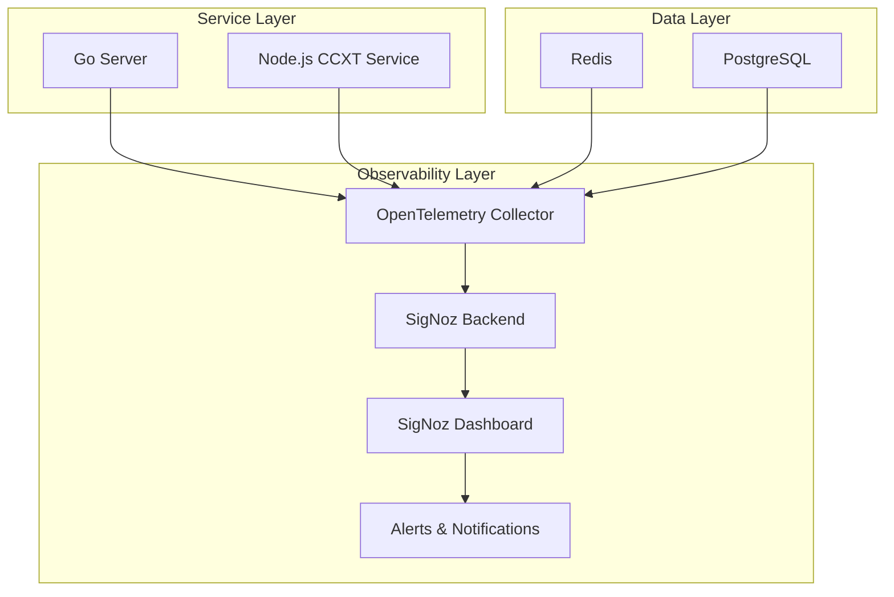

# SigNoz Observability Implementation Architecture

## 1. Product Overview

Comprehensive observability implementation using SigNoz with OpenTelemetry across our multi-language arbitrage trading application stack. This solution provides distributed tracing, error tracking, and performance monitoring for Go 1.25 server, Node.js CCXT service, Redis, and PostgreSQL components.

The implementation enables end-to-end visibility across all services, real-time error root cause analysis, and performance optimization insights for the cryptocurrency arbitrage detection system.

## 2. Core Features

### 2.1 User Roles

| Role | Access Method | Core Permissions |
|------|---------------|------------------|
| DevOps Engineer | SigNoz Dashboard Admin | Full access to all traces, metrics, logs, and system configuration |
| Developer | SigNoz Dashboard User | View traces, errors, and performance metrics for debugging |
| System Administrator | SigNoz Dashboard Viewer | Monitor system health, alerts, and service status |

### 2.2 Feature Module

Our SigNoz observability implementation consists of the following main components:

1. **SigNoz Dashboard**: Central monitoring interface, distributed tracing visualization, error tracking, performance metrics
2. **OpenTelemetry Collector**: Data aggregation hub, trace processing, metrics collection, log forwarding
3. **Service Instrumentation**: Go 1.25 server tracing, Node.js CCXT service monitoring, database query tracking
4. **Infrastructure Monitoring**: Redis performance tracking, PostgreSQL query analysis, system resource monitoring
5. **Alert Management**: Error threshold alerts, performance degradation notifications, service health monitoring

### 2.3 Page Details

| Component | Module | Feature Description |
|-----------|--------|--------------------|
| SigNoz Dashboard | Traces View | Visualize distributed traces across all services, analyze request flows, identify bottlenecks |
| SigNoz Dashboard | Metrics View | Monitor service performance, track custom business metrics, view system resource usage |
| SigNoz Dashboard | Logs View | Centralized log aggregation, structured log search, correlation with traces |
| SigNoz Dashboard | Alerts Management | Configure alert rules, manage notification channels, track alert history |
| OpenTelemetry Collector | Data Processing | Receive telemetry data, process and enrich traces, forward to SigNoz backend |
| Go Server | Instrumentation | HTTP request tracing, database query spans, custom business logic tracking |
| Node.js CCXT | Instrumentation | Exchange API call tracing, market data processing spans, error tracking |
| Redis | Monitoring | Command execution tracking, connection pool monitoring, performance metrics |
| PostgreSQL | Monitoring | Query execution tracing, connection monitoring, slow query detection |

## 3. Core Process

### Main Observability Flow

1. **Service Initialization**: Each service (Go server, Node.js CCXT, Redis, PostgreSQL) initializes OpenTelemetry SDK with proper configuration
2. **Trace Generation**: Services automatically generate spans for HTTP requests, database queries, external API calls, and custom business operations
3. **Data Collection**: OpenTelemetry Collector receives telemetry data from all services via OTLP protocol
4. **Data Processing**: Collector processes, enriches, and forwards trace data to SigNoz backend for storage and analysis
5. **Visualization**: SigNoz dashboard provides real-time visualization of traces, metrics, and logs for monitoring and debugging
6. **Alert Processing**: Alert rules evaluate incoming data and trigger notifications when thresholds are exceeded

### Error Tracking Flow

1. **Error Detection**: Services capture exceptions and errors automatically through OpenTelemetry instrumentation
2. **Context Enrichment**: Error spans include relevant context like user ID, request parameters, and system state
3. **Root Cause Analysis**: SigNoz correlates errors with distributed traces to identify the root cause across services
4. **Alert Generation**: Critical errors trigger immediate alerts to development and operations teams

## 4. User Interface Design

### 4.1 Design Style

- **Primary Colors**: SigNoz default dark theme with blue (#1890FF) and orange (#FA8C16) accents
- **Secondary Colors**: Gray scale (#F0F0F0, #D9D9D9, #8C8C8C) for backgrounds and borders
- **Layout Style**: Modern dashboard with card-based components, responsive grid layout
- **Typography**: Inter font family, 14px base size for readability
- **Icons**: Ant Design icon set for consistency with SigNoz interface

### 4.2 Page Design Overview

| Component | Module | UI Elements |
|-----------|--------|-------------|
| SigNoz Dashboard | Traces View | Timeline visualization, service map, span details panel, filter controls |
| SigNoz Dashboard | Metrics View | Time series charts, gauge widgets, comparison views, custom dashboards |
| SigNoz Dashboard | Logs View | Log stream interface, search filters, log level indicators, timestamp navigation |
| SigNoz Dashboard | Alerts | Alert status cards, rule configuration forms, notification channel setup |
| Service Health | Overview | Service status indicators, uptime metrics, error rate displays |

### 4.3 Responsiveness

SigNoz dashboard is desktop-first with responsive design for tablet and mobile viewing. Touch interaction optimization for mobile debugging scenarios, with collapsible panels and swipe navigation for trace exploration.

## 5. Implementation Architecture

### 5.1 Self-Hosted SigNoz Deployment

- **Deployment Method**: Docker Compose with persistent volumes
- **Resource Requirements**: 4GB RAM minimum, 20GB storage for trace data
- **Network Configuration**: Internal Docker network with external access on port 3301
- **Data Persistence**: ClickHouse for trace storage, Redis for caching

### 5.2 OpenTelemetry Integration

- **Go 1.25 Server**: `go.opentelemetry.io/otel` v1.32+ with HTTP and database instrumentation
- **Node.js CCXT Service**: `@opentelemetry/api` v1.9+ with auto-instrumentation
- **Collector Configuration**: OTLP receivers, batch processors, SigNoz exporters
- **Sampling Strategy**: Probabilistic sampling with 100% error trace retention

### 5.3 Service Discovery

- **Container Networking**: Docker Compose service discovery
- **Health Checks**: OpenTelemetry health check endpoints
- **Load Balancing**: Round-robin for multiple service instances
- **Failover**: Automatic collector failover with backup endpoints

This architecture ensures comprehensive observability across the entire application stack while maintaining performance and reliability standards.