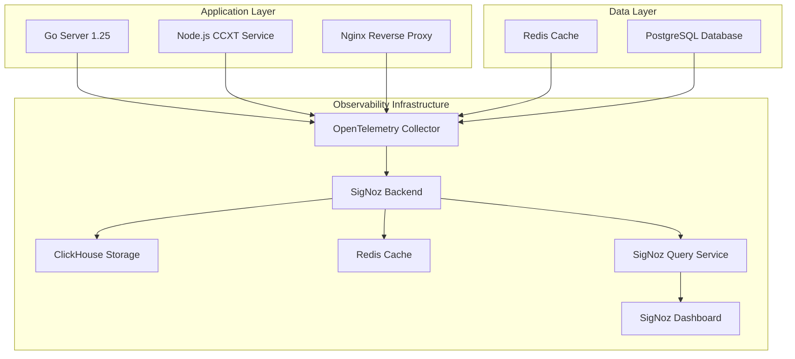

# SigNoz Technical Implementation Guide

## 1. Architecture Design



## 2. Technology Description

- **Frontend**: SigNoz Dashboard (React-based)
- **Backend**: SigNoz Backend Services (Go-based)
- **Collector**: OpenTelemetry Collector v0.91+
- **Storage**: ClickHouse v23.8+ for traces, Redis v7+ for caching
- **Instrumentation**: 
  - Go 1.25: `go.opentelemetry.io/otel` v1.32+
  - Node.js: `@opentelemetry/api` v1.9+
  - Auto-instrumentation libraries for HTTP, database, Redis

## 3. Service Instrumentation Strategy

### 3.1 Go 1.25 Server Instrumentation

```go
// OpenTelemetry initialization
package telemetry

import (
    "context"
    "go.opentelemetry.io/otel"
    "go.opentelemetry.io/otel/exporters/otlp/otlptrace/otlptracehttp"
    "go.opentelemetry.io/otel/propagation"
    "go.opentelemetry.io/otel/sdk/resource"
    "go.opentelemetry.io/otel/sdk/trace"
    "go.opentelemetry.io/otel/semconv/v1.21.0"
    "go.opentelemetry.io/contrib/instrumentation/net/http/otelhttp"
    "go.opentelemetry.io/contrib/instrumentation/database/sql/otelsql"
)

func InitTracer(serviceName, collectorURL string) (*trace.TracerProvider, error) {
    exporter, err := otlptracehttp.New(
        context.Background(),
        // WithEndpoint expects host:port, not a URL scheme
        otlptracehttp.WithEndpoint(collectorURL),
        otlptracehttp.WithInsecure(),
    )
    if err != nil {
        return nil, err
    }

    resource := resource.NewWithAttributes(
        semconv.SchemaURL,
        semconv.ServiceName(serviceName),
        semconv.ServiceVersion("1.0.0"),
    )

    tp := trace.NewTracerProvider(
        trace.WithBatcher(exporter),
        trace.WithResource(resource),
        trace.WithSampler(trace.AlwaysSample()),
    )

    otel.SetTracerProvider(tp)
    otel.SetTextMapPropagator(propagation.TraceContext{})
    
    return tp, nil
}
```

### 3.2 Node.js CCXT Service Instrumentation

```javascript
// OpenTelemetry initialization for Node.js
const { NodeSDK } = require('@opentelemetry/sdk-node');
const { getNodeAutoInstrumentations } = require('@opentelemetry/auto-instrumentations-node');
const { OTLPTraceExporter } = require('@opentelemetry/exporter-otlp-http');
const { Resource } = require('@opentelemetry/resources');
const { SemanticResourceAttributes } = require('@opentelemetry/semantic-conventions');

const sdk = new NodeSDK({
  resource: new Resource({
    [SemanticResourceAttributes.SERVICE_NAME]: 'ccxt-service',
    [SemanticResourceAttributes.SERVICE_VERSION]: '1.0.0',
  }),
  traceExporter: new OTLPTraceExporter({
    url: 'http://otel-collector:4318/v1/traces',
  }),
  instrumentations: [getNodeAutoInstrumentations()],
});

sdk.start();
```

### 3.3 Database Instrumentation

```go
// PostgreSQL instrumentation
db, err := otelsql.Open("postgres", dsn,
    otelsql.WithAttributes(
        semconv.DBSystemPostgreSQL,
    ),
)

// Redis instrumentation
import "github.com/go-redis/redis/extra/redisotel/v8"

rdb := redis.NewClient(&redis.Options{
    Addr: "localhost:6379",
})
rdb.AddHook(redisotel.NewTracingHook())
```

## 4. Docker Configuration

### 4.1 SigNoz Docker Compose

```yaml
# docker-compose.signoz.yml
version: '3.8'

services:
  # SigNoz Services
  clickhouse:
    image: clickhouse/clickhouse-server:23.8-alpine
    container_name: signoz-clickhouse
    hostname: clickhouse
    ports:
      - "9000:9000"
      - "8123:8123"
    volumes:
      - ./data/clickhouse:/var/lib/clickhouse/
    environment:
      - CLICKHOUSE_DB=signoz_traces
    restart: unless-stopped

  query-service:
    image: signoz/query-service:0.39.0
    container_name: signoz-query-service
    command: ["-config=/root/config/prometheus.yml"]
    volumes:
      - ./config/prometheus.yml:/root/config/prometheus.yml
    environment:
      - ClickHouseUrl=tcp://clickhouse:9000
    ports:
      - "6060:6060"
      - "8080:8080"
    restart: unless-stopped
    depends_on:
      - clickhouse

  frontend:
    image: signoz/frontend:0.39.0
    container_name: signoz-frontend
    ports:
      - "3301:3301"
    volumes:
      - ./config/nginx.conf:/etc/nginx/nginx.conf
    restart: unless-stopped
    depends_on:
      - query-service

  otel-collector:
    image: signoz/signoz-otel-collector:0.88.11
    container_name: signoz-otel-collector
    command: ["--config=/etc/otelcol-contrib/otel-collector-config.yaml"]
    volumes:
      - ./config/otel-collector-config.yaml:/etc/otelcol-contrib/otel-collector-config.yaml
    ports:
      - "4317:4317"   # OTLP gRPC receiver
      - "4318:4318"   # OTLP HTTP receiver
      - "8888:8888"   # Collector self-metrics
      - "8889:8889"   # Prometheus exporter
    restart: unless-stopped
    depends_on:
      - query-service

networks:
  default:
    name: signoz-network
```

### 4.2 OpenTelemetry Collector Configuration

```yaml
# config/otel-collector-config.yaml
receivers:
  otlp:
    protocols:
      grpc:
        endpoint: 0.0.0.0:4317
      http:
        endpoint: 0.0.0.0:4318
        cors:
          allowed_origins:
            - "*"
  
  prometheus:
    config:
      scrape_configs:
        - job_name: 'otel-collector'
          static_configs:
            - targets: ['localhost:8888']

processors:
  batch:
    timeout: 1s
    send_batch_size: 1024
  
  memory_limiter:
    limit_mib: 512
  
  resource:
    attributes:
      - key: environment
        value: production
        action: upsert

exporters:
  clickhouse:
    endpoint: tcp://clickhouse:9000?database=signoz_traces
    username: default
    password: "${CLICKHOUSE_PASSWORD:?CLICKHOUSE_PASSWORD is required}"
    timeout: 5s
    retry_on_failure:
      enabled: true
      initial_interval: 5s
      max_interval: 30s
      max_elapsed_time: 300s

  prometheus:
    endpoint: "0.0.0.0:8889"

extensions:
  health_check: {}

service:
  pipelines:
    traces:
      receivers: [otlp]
      processors: [memory_limiter, batch, resource]
      exporters: [clickhouse]
    
    metrics:
      receivers: [otlp, prometheus]
      processors: [memory_limiter, batch, resource]
      exporters: [prometheus]

  extensions: [health_check]
```

## 5. Application Integration

### 5.1 Go Server Integration

```go
// main.go modifications
package main

import (
    "context"
    "log"
    "net/http"
    "os"
    "os/signal"
    "syscall"
    "time"
    
    "go.opentelemetry.io/contrib/instrumentation/net/http/otelhttp"
    "your-app/internal/telemetry"
)

func main() {
    // Initialize OpenTelemetry
    tp, err := telemetry.InitTracer("arbitrage-server", "localhost:4318")
    if err != nil {
        log.Fatal("Failed to initialize tracer:", err)
    }
    defer func() {
        if err := tp.Shutdown(context.Background()); err != nil {
            log.Printf("Error shutting down tracer provider: %v", err)
        }
    }()

    // Wrap HTTP handlers with OpenTelemetry
    mux := http.NewServeMux()
    mux.Handle("/api/", otelhttp.NewHandler(apiHandler, "api"))
    mux.Handle("/opportunities", otelhttp.NewHandler(opportunitiesHandler, "opportunities"))
    
    server := &http.Server{
        Addr:    ":8080",
        Handler: mux,
    }
    
    // Graceful shutdown
    go func() {
        if err := server.ListenAndServe(); err != nil && err != http.ErrServerClosed {
            log.Fatal("Server failed to start:", err)
        }
    }()
    
    quit := make(chan os.Signal, 1)
    signal.Notify(quit, syscall.SIGINT, syscall.SIGTERM)
    <-quit
    
    ctx, cancel := context.WithTimeout(context.Background(), 30*time.Second)
    defer cancel()
    
    if err := server.Shutdown(ctx); err != nil {
        log.Fatal("Server forced to shutdown:", err)
    }
}
```

### 5.2 Custom Business Logic Tracing

```go
// Custom spans for business logic
package arbitrage

import (
    "context"
    "go.opentelemetry.io/otel"
    "go.opentelemetry.io/otel/attribute"
    "go.opentelemetry.io/otel/trace"
)

var tracer = otel.Tracer("arbitrage-service")

func (s *Service) DetectOpportunities(ctx context.Context, exchanges []string) ([]Opportunity, error) {
    ctx, span := tracer.Start(ctx, "detect_opportunities")
    defer span.End()
    
    span.SetAttributes(
        attribute.StringSlice("exchanges", exchanges),
        attribute.Int("exchange_count", len(exchanges)),
    )
    
    opportunities := make([]Opportunity, 0)
    
    for _, exchange := range exchanges {
        ctx, childSpan := tracer.Start(ctx, "fetch_exchange_data")
        childSpan.SetAttributes(attribute.String("exchange", exchange))
        
        data, err := s.fetchExchangeData(ctx, exchange)
        if err != nil {
            childSpan.RecordError(err)
            childSpan.SetStatus(codes.Error, err.Error())
            childSpan.End()
            continue
        }
        
        childSpan.SetAttributes(attribute.Int("pairs_count", len(data.Pairs)))
        childSpan.End()
        
        // Process data and detect opportunities
        ops := s.analyzeArbitrage(ctx, data)
        opportunities = append(opportunities, ops...)
    }
    
    span.SetAttributes(attribute.Int("opportunities_found", len(opportunities)))
    return opportunities, nil
}
```

## 6. Migration Plan

### 6.1 Phase 1: Infrastructure Setup (Week 1)
- Deploy SigNoz using Docker Compose
- Configure OpenTelemetry Collector
- Set up basic health checks and monitoring

### 6.2 Phase 2: Go Server Instrumentation (Week 2)
- Integrate OpenTelemetry SDK in Go 1.25 server
- Add HTTP request tracing
- Implement database query instrumentation
- Add custom business logic spans

### 6.3 Phase 3: Node.js Service Instrumentation (Week 3)
- Add OpenTelemetry auto-instrumentation to CCXT service
- Implement custom spans for exchange API calls
- Add error tracking and performance monitoring

### 6.4 Phase 4: Database and Cache Monitoring (Week 4)
- Implement PostgreSQL query tracing
- Add Redis command monitoring
- Set up performance baselines and alerts

### 6.5 Phase 5: Production Deployment and Optimization (Week 5)
- Deploy to production environment
- Configure sampling strategies
- Set up alerting rules and dashboards
- Performance tuning and optimization

## 7. Monitoring and Alerting

### 7.1 Key Metrics to Monitor
- **Request Latency**: P95, P99 response times across all services
- **Error Rates**: 4xx/5xx error percentages by service and endpoint
- **Throughput**: Requests per second, database queries per second
- **Resource Usage**: CPU, memory, disk usage for all services
- **Business Metrics**: Opportunities detected per minute, exchange API success rates

### 7.2 Alert Configuration
```yaml
# Alert rules example
alerts:
  - name: high_error_rate
    condition: error_rate > 5%
    duration: 5m
    severity: critical
    
  - name: high_latency
    condition: p95_latency > 2s
    duration: 10m
    severity: warning
    
  - name: service_down
    condition: up == 0
    duration: 1m
    severity: critical
```

This implementation provides comprehensive observability across the entire application stack while maintaining performance and ensuring easy debugging and monitoring capabilities.
