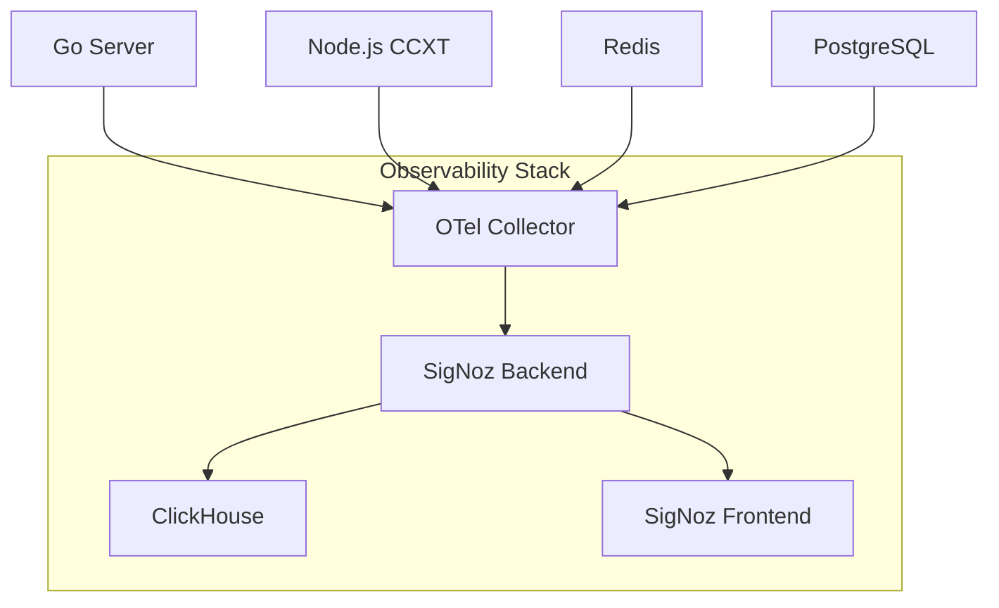

# SigNoz Observability Implementation Guide

## 1. Overview

This document outlines the comprehensive implementation of SigNoz for distributed tracing, error tracking, and observability across our entire application stack. The implementation covers our Go main server, Node.js CCXT service, Redis cache, and PostgreSQL database with end-to-end visibility.

### Current Stack Analysis
- **Go Main Server**: Core application on port 8080
- **Node.js CCXT Service**: Exchange data service on port 3001  
- **Redis**: Caching layer
- **PostgreSQL**: Primary database
- **Telegram Bot**: Webhook integration

## 2. SigNoz Architecture Design

### 2.1 Self-Hosted SigNoz Deployment



### 2.2 Docker Compose Configuration

```yaml
# docker-compose.signoz.yml
version: '3.8'

services:
  # SigNoz Services
  clickhouse:
    image: clickhouse/clickhouse-server:22.8-alpine
    container_name: signoz-clickhouse
    hostname: clickhouse
    ports:
      - "9000:9000"
      - "8123:8123"
    volumes:
      - ./signoz/clickhouse-config.xml:/etc/clickhouse-server/config.xml
      - ./signoz/clickhouse-users.xml:/etc/clickhouse-server/users.xml
      - signoz-clickhouse-data:/var/lib/clickhouse
    environment:
      - CLICKHOUSE_DB=signoz_traces
    networks:
      - signoz-network

  query-service:
    image: signoz/query-service:0.34.0
    container_name: signoz-query-service
    command: ["-config=/root/config/prometheus.yml"]
    volumes:
      - ./signoz/prometheus.yml:/root/config/prometheus.yml
      - ../logs:/var/log/signoz
    environment:
      - ClickHouseUrl=tcp://clickhouse:9000
      - STORAGE=clickhouse
      - GODEBUG=netdns=go
      - TELEMETRY_ENABLED=true
      - DEPLOYMENT_TYPE=docker-standalone-amd
    ports:
      - "6060:6060"
      - "8080:8080"
    depends_on:
      - clickhouse
    networks:
      - signoz-network

  frontend:
    image: signoz/frontend:0.34.0
    container_name: signoz-frontend
    ports:
      - "3301:3301"
    volumes:
      - ../common/nginx-config.conf:/etc/nginx/conf.d/default.conf
    depends_on:
      - query-service
    networks:
      - signoz-network

  otel-collector:
    image: signoz/signoz-otel-collector:0.79.0
    container_name: signoz-otel-collector
    command: ["--config=/etc/otelcol-contrib/otel-collector-config.yaml"]
    volumes:
      - ./signoz/otel-collector-config.yaml:/etc/otelcol-contrib/otel-collector-config.yaml
    ports:
      - "1777:1777"     # pprof extension
      - "4317:4317"     # OTLP gRPC receiver
      - "4318:4318"     # OTLP HTTP receiver
      - "8888:8888"     # OtelCollector internal metrics
      - "8889:8889"     # signoz spanmetrics exposed by the agent
      - "9411:9411"     # Zipkin port
      - "13133:13133"   # health_check extension
      - "14250:14250"   # Jaeger gRPC
      - "14268:14268"   # Jaeger thrift HTTP
    depends_on:
      - query-service
    networks:
      - signoz-network

volumes:
  signoz-clickhouse-data:

networks:
  signoz-network:
    driver: bridge
```

## 3. OpenTelemetry Collector Configuration

### 3.1 OTel Collector Config

```yaml
# signoz/otel-collector-config.yaml
receivers:
  otlp:
    protocols:
      grpc:
        endpoint: 0.0.0.0:4317
      http:
        endpoint: 0.0.0.0:4318
  jaeger:
    protocols:
      grpc:
        endpoint: 0.0.0.0:14250
      thrift_http:
        endpoint: 0.0.0.0:14268
  zipkin:
    endpoint: 0.0.0.0:9411
  prometheus:
    config:
      scrape_configs:
        - job_name: 'go-server'
          static_configs:
            - targets: ['host.docker.internal:8080']
        - job_name: 'ccxt-service'
          static_configs:
            - targets: ['host.docker.internal:3001']

processors:
  batch:
    timeout: 1s
    send_batch_size: 1024
  memory_limiter:
    limit_mib: 512
  resource:
    attributes:
      - key: service.namespace
        value: "celebrum-ai"
        action: upsert

exporters:
  clickhouse:
    endpoint: tcp://clickhouse:9000?database=signoz_traces
    username: default
    password: "${CLICKHOUSE_PASSWORD:?CLICKHOUSE_PASSWORD is required}"
    timeout: 5s
    retry_on_failure:
      enabled: true
      initial_interval: 5s
      max_interval: 30s
      max_elapsed_time: 300s

service:
  pipelines:
    traces:
      receivers: [otlp, jaeger, zipkin]
      processors: [memory_limiter, batch, resource]
      exporters: [clickhouse]
    metrics:
      receivers: [otlp, prometheus]
      processors: [memory_limiter, batch, resource]
      exporters: [clickhouse]
    logs:
      receivers: [otlp]
      processors: [memory_limiter, batch, resource]
      exporters: [clickhouse]

  extensions: [health_check, pprof, zpages]
```

## 4. Go Server OpenTelemetry Instrumentation

### 4.1 Dependencies

```go
// go.mod additions
require (
    go.opentelemetry.io/otel v1.21.0
    go.opentelemetry.io/otel/exporters/otlp/otlptrace/otlptracegrpc v1.21.0
    go.opentelemetry.io/otel/sdk v1.21.0
    go.opentelemetry.io/otel/trace v1.21.0
    go.opentelemetry.io/contrib/instrumentation/net/http/otelhttp v0.46.0
    go.opentelemetry.io/contrib/instrumentation/github.com/gorilla/mux/otelmux v0.46.0
    go.opentelemetry.io/contrib/instrumentation/database/sql/otelsql v0.46.0
    go.opentelemetry.io/otel/metric v1.21.0
    go.opentelemetry.io/otel/exporters/otlp/otlpmetric/otlpmetricgrpc v0.44.0
)
```

### 4.2 Telemetry Initialization

```go
// internal/telemetry/telemetry.go
package telemetry

import (
    "context"
    "fmt"
    "time"

    "go.opentelemetry.io/otel"
    "go.opentelemetry.io/otel/exporters/otlp/otlptrace/otlptracegrpc"
    "go.opentelemetry.io/otel/propagation"
    "go.opentelemetry.io/otel/sdk/resource"
    "go.opentelemetry.io/otel/sdk/trace"
    semconv "go.opentelemetry.io/otel/semconv/v1.21.0"
    "google.golang.org/grpc"
    "google.golang.org/grpc/credentials/insecure"
)

type TelemetryConfig struct {
    ServiceName    string
    ServiceVersion string
    OTelEndpoint   string
    Environment    string
}

func InitTelemetry(ctx context.Context, config TelemetryConfig) (*trace.TracerProvider, error) {
    // Create OTLP trace exporter
    conn, err := grpc.DialContext(ctx, config.OTelEndpoint,
        grpc.WithTransportCredentials(insecure.NewCredentials()),
        grpc.WithBlock(),
    )
    if err != nil {
        return nil, fmt.Errorf("failed to create gRPC connection: %w", err)
    }

    traceExporter, err := otlptracegrpc.New(ctx, otlptracegrpc.WithGRPCConn(conn))
    if err != nil {
        return nil, fmt.Errorf("failed to create trace exporter: %w", err)
    }

    // Create resource
    res, err := resource.New(ctx,
        resource.WithAttributes(
            semconv.ServiceName(config.ServiceName),
            semconv.ServiceVersion(config.ServiceVersion),
            semconv.DeploymentEnvironment(config.Environment),
        ),
    )
    if err != nil {
        return nil, fmt.Errorf("failed to create resource: %w", err)
    }

    // Create trace provider
    tp := trace.NewTracerProvider(
        trace.WithBatcher(traceExporter),
        trace.WithResource(res),
        trace.WithSampler(trace.AlwaysSample()),
    )

    // Set global providers
    otel.SetTracerProvider(tp)
    otel.SetTextMapPropagator(propagation.NewCompositeTextMapPropagator(
        propagation.TraceContext{},
        propagation.Baggage{},
    ))

    return tp, nil
}

func Shutdown(ctx context.Context, tp *trace.TracerProvider) error {
    ctx, cancel := context.WithTimeout(ctx, 5*time.Second)
    defer cancel()
    return tp.Shutdown(ctx)
}
```

### 4.3 HTTP Middleware Integration

```go
// internal/middleware/tracing.go
package middleware

import (
    "net/http"

    "go.opentelemetry.io/contrib/instrumentation/net/http/otelhttp"
    "go.opentelemetry.io/otel"
    "go.opentelemetry.io/otel/attribute"
    "go.opentelemetry.io/otel/trace"
)

func TracingMiddleware(serviceName string) func(http.Handler) http.Handler {
    return otelhttp.NewMiddleware(serviceName)
}

func AddSpanAttributes(r *http.Request, attrs ...attribute.KeyValue) {
    span := trace.SpanFromContext(r.Context())
    span.SetAttributes(attrs...)
}

func StartSpan(ctx context.Context, name string, opts ...trace.SpanStartOption) (context.Context, trace.Span) {
    tracer := otel.Tracer("celebrum-ai-go")
    return tracer.Start(ctx, name, opts...)
}
```

### 4.4 Database Instrumentation

```go
// internal/database/postgres_traced.go
package database

import (
    "database/sql"
    "fmt"

    "go.opentelemetry.io/contrib/instrumentation/database/sql/otelsql"
    _ "github.com/lib/pq"
)

func NewTracedPostgresConnection(dsn string) (*sql.DB, error) {
    // Register the otelsql wrapper for the postgres driver
    driverName, err := otelsql.Register("postgres",
        otelsql.WithAttributes(
            semconv.DBSystemPostgreSQL,
        ),
    )
    if err != nil {
        return nil, fmt.Errorf("failed to register otelsql driver: %w", err)
    }

    // Open database connection with tracing
    db, err := sql.Open(driverName, dsn)
    if err != nil {
        return nil, fmt.Errorf("failed to open database: %w", err)
    }

    return db, nil
}
```

## 5. Node.js CCXT Service Instrumentation

### 5.1 Dependencies

```json
{
  "dependencies": {
    "@opentelemetry/api": "^1.7.0",
    "@opentelemetry/sdk-node": "^0.45.0",
    "@opentelemetry/exporter-trace-otlp-grpc": "^0.45.0",
    "@opentelemetry/instrumentation-http": "^0.45.0",
    "@opentelemetry/instrumentation-express": "^0.34.0",
    "@opentelemetry/instrumentation-redis": "^0.35.0",
    "@opentelemetry/semantic-conventions": "^1.17.0"
  }
}
```

### 5.2 Telemetry Setup

```typescript
// ccxt-service/telemetry.ts
import { NodeSDK } from '@opentelemetry/sdk-node';
import { OTLPTraceExporter } from '@opentelemetry/exporter-trace-otlp-grpc';
import { HttpInstrumentation } from '@opentelemetry/instrumentation-http';
import { ExpressInstrumentation } from '@opentelemetry/instrumentation-express';
import { RedisInstrumentation } from '@opentelemetry/instrumentation-redis';
import { Resource } from '@opentelemetry/resources';
import { SemanticResourceAttributes } from '@opentelemetry/semantic-conventions';

const traceExporter = new OTLPTraceExporter({
  url: process.env.OTEL_EXPORTER_OTLP_ENDPOINT || 'http://localhost:4317',
});

const sdk = new NodeSDK({
  resource: new Resource({
    [SemanticResourceAttributes.SERVICE_NAME]: 'ccxt-service',
    [SemanticResourceAttributes.SERVICE_VERSION]: '1.0.0',
    [SemanticResourceAttributes.DEPLOYMENT_ENVIRONMENT]: process.env.NODE_ENV || 'development',
  }),
  traceExporter,
  instrumentations: [
    new HttpInstrumentation(),
    new ExpressInstrumentation(),
    new RedisInstrumentation(),
  ],
});

export function initTelemetry(): void {
  sdk.start();
  console.log('OpenTelemetry started successfully');
}

export function shutdownTelemetry(): Promise<void> {
  return sdk.shutdown();
}
```

### 5.3 Manual Instrumentation

```typescript
// ccxt-service/tracing.ts
import { trace, context, SpanStatusCode } from '@opentelemetry/api';

const tracer = trace.getTracer('ccxt-service');

export function traceExchangeCall<T>(
  exchangeName: string,
  method: string,
  operation: () => Promise<T>
): Promise<T> {
  return tracer.startActiveSpan(`exchange.${exchangeName}.${method}`, async (span) => {
    try {
      span.setAttributes({
        'exchange.name': exchangeName,
        'exchange.method': method,
      });
      
      const result = await operation();
      span.setStatus({ code: SpanStatusCode.OK });
      return result;
    } catch (error) {
      span.setStatus({
        code: SpanStatusCode.ERROR,
        message: error instanceof Error ? error.message : 'Unknown error',
      });
      span.recordException(error as Error);
      throw error;
    } finally {
      span.end();
    }
  });
}
```

## 6. Distributed Tracing Configuration

### 6.1 Cross-Service Trace Propagation

```go
// internal/services/ccxt_client.go
package services

import (
    "context"
    "net/http"

    "go.opentelemetry.io/otel"
    "go.opentelemetry.io/otel/propagation"
)

func (c *CCXTClient) makeRequest(ctx context.Context, endpoint string) (*http.Response, error) {
    req, err := http.NewRequestWithContext(ctx, "GET", endpoint, nil)
    if err != nil {
        return nil, err
    }

    // Inject trace context into HTTP headers
    otel.GetTextMapPropagator().Inject(ctx, propagation.HeaderCarrier(req.Header))

    return c.httpClient.Do(req)
}
```

### 6.2 Redis Tracing

```go
// internal/cache/redis_traced.go
package cache

import (
    "context"
    "time"

    "github.com/go-redis/redis/v8"
    "go.opentelemetry.io/otel"
    "go.opentelemetry.io/otel/attribute"
    "go.opentelemetry.io/otel/trace"
)

type TracedRedisClient struct {
    client *redis.Client
    tracer trace.Tracer
}

func NewTracedRedisClient(addr, password string, db int) *TracedRedisClient {
    client := redis.NewClient(&redis.Options{
        Addr:     addr,
        Password: password,
        DB:       db,
    })

    return &TracedRedisClient{
        client: client,
        tracer: otel.Tracer("redis-client"),
    }
}

func (r *TracedRedisClient) Get(ctx context.Context, key string) (string, error) {
    ctx, span := r.tracer.Start(ctx, "redis.get")
    defer span.End()

    span.SetAttributes(
        attribute.String("redis.operation", "GET"),
        attribute.String("redis.key", key),
    )

    start := time.Now()
    result, err := r.client.Get(ctx, key).Result()
    duration := time.Since(start)

    span.SetAttributes(
        attribute.Int64("redis.duration_ms", duration.Milliseconds()),
    )

    if err != nil {
        span.RecordError(err)
        return "", err
    }

    return result, nil
}
```

## 7. Error Tracking and Logging Migration

### 7.1 Structured Logging with OpenTelemetry

```go
// internal/logging/otel_logger.go
package logging

import (
    "context"
    "log/slog"
    "os"

    "go.opentelemetry.io/otel/trace"
)

type OTelHandler struct {
    handler slog.Handler
}

func NewOTelHandler() *OTelHandler {
    return &OTelHandler{
        handler: slog.NewJSONHandler(os.Stdout, &slog.HandlerOptions{
            Level: slog.LevelInfo,
        }),
    }
}

func (h *OTelHandler) Handle(ctx context.Context, record slog.Record) error {
    // Add trace context to log record
    span := trace.SpanFromContext(ctx)
    if span.SpanContext().IsValid() {
        record.AddAttrs(
            slog.String("trace_id", span.SpanContext().TraceID().String()),
            slog.String("span_id", span.SpanContext().SpanID().String()),
        )
    }

    return h.handler.Handle(ctx, record)
}

func (h *OTelHandler) Enabled(ctx context.Context, level slog.Level) bool {
    return h.handler.Enabled(ctx, level)
}

func (h *OTelHandler) WithAttrs(attrs []slog.Attr) slog.Handler {
    return &OTelHandler{handler: h.handler