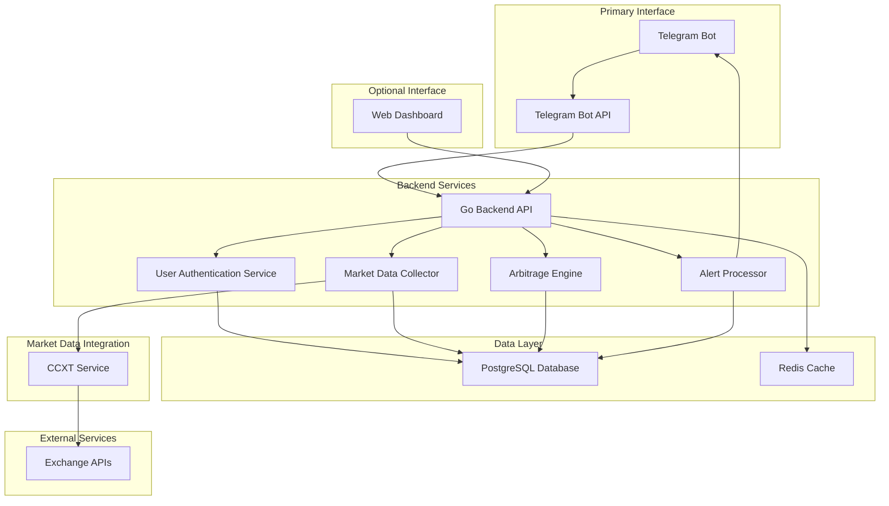
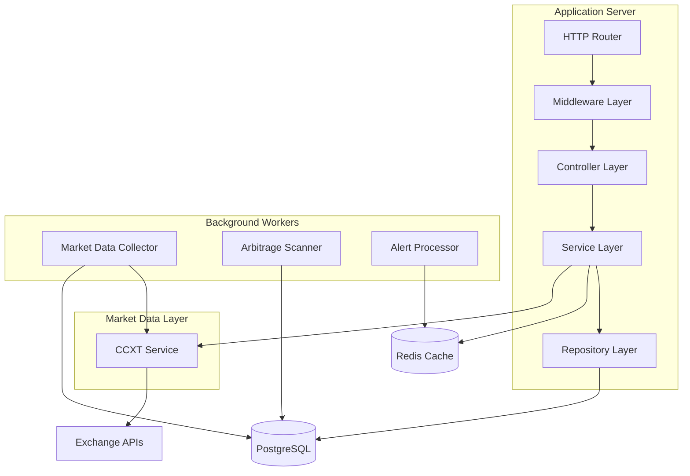
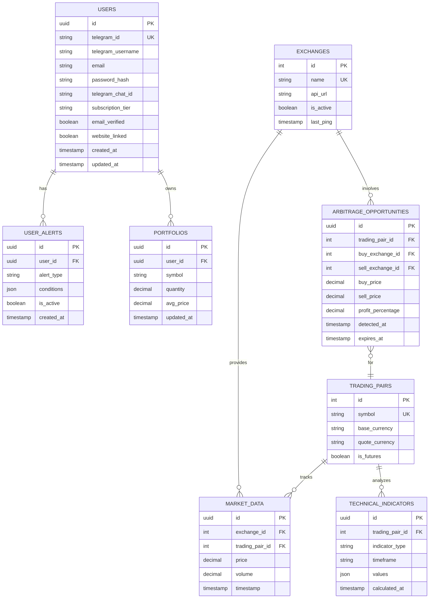

# Technical Architecture - Celebrum AI Platform

## 1. Architecture Design



## 2. Technology Description

- **Backend**: Go 1.21+ with Gin framework, goroutines for concurrent data collection
- **Market Data**: CCXT library integration via Go bindings or REST API for unified exchange access
- **Database**: PostgreSQL 15+ for persistent storage, Redis 7+ for caching and real-time data
- **Frontend**: React 18 + TypeScript + Tailwind CSS + Vite
- **Telegram**: Telegram Bot API with webhook integration
- **Deployment**: Docker containers on Digital Ocean droplets with nginx reverse proxy
- **Testing**: Go testing framework, testify for assertions, minimum 60% coverage
- **Monitoring**: Prometheus metrics, structured logging with logrus

### 2.1 CCXT Integration Details

**CCXT Library Configuration:**
- **Implementation**: Node.js CCXT service with REST API interface for Go backend
- **Supported Exchanges**: Binance, Bybit, OKX, Coinbase Pro, Kraken, and 100+ others
- **Data Types**: Real-time tickers, order books, OHLCV candles, trades, futures data
- **Rate Limiting**: Built-in exchange-specific rate limiting and retry mechanisms
- **Error Handling**: Unified error handling across different exchange APIs
- **WebSocket Support**: Real-time data streaming for supported exchanges

**CCXT Service Architecture:**
```
Go Backend → HTTP/REST → CCXT Service (Node.js) → Exchange APIs
```

**Key Features:**
- Unified API interface across all supported exchanges
- Automatic symbol normalization and market type detection
- Built-in authentication and API key management
- Concurrent data fetching with configurable timeouts
- Automatic failover and exchange health monitoring

## 3. Interface Definitions

### 3.1 Telegram Bot Commands

| Command | Purpose |
|---------|----------|
| /start | User registration and onboarding, welcome message with feature overview |
| /opportunities | View current arbitrage opportunities with profit calculations |
| /settings | Configure alert preferences, subscription management |
| /upgrade | Upgrade to premium subscription, payment integration |
| /help | Display available commands and feature explanations |
| /link | Connect Telegram account to website for advanced features |
| /status | Check subscription status and account information |

### 3.2 Web Dashboard Routes (Optional - for linked accounts)

| Route | Purpose |
|-------|----------|
| / | Landing page with Telegram bot connection option |
| /dashboard | Advanced market overview and detailed arbitrage analysis |
| /charts | Interactive technical analysis charts and indicators |
| /portfolio | Comprehensive portfolio tracking and performance metrics |
| /settings | Advanced preferences and API configurations |
| /auth/telegram | Telegram account linking and authentication |

## 4. API Definitions

### 4.1 Core API

**Market Data Endpoints**
```
GET /api/v1/market/prices
```
Request:
| Param Name | Param Type | isRequired | Description |
|------------|------------|------------|-------------|
| symbols | []string | false | List of trading pairs (default: all) |
| exchange | string | false | Specific exchange filter |

Response:
| Param Name | Param Type | Description |
|------------|------------|-------------|
| data | []MarketPrice | Array of current market prices |
| timestamp | int64 | Unix timestamp of data |

**Arbitrage Opportunities**
```
GET /api/v1/arbitrage/opportunities
```
Request:
| Param Name | Param Type | isRequired | Description |
|------------|------------|------------|-------------|
| min_profit | float64 | false | Minimum profit percentage |
| symbol | string | false | Trading pair filter |

Response:
| Param Name | Param Type | Description |
|------------|------------|-------------|
| opportunities | []ArbitrageOpportunity | List of current opportunities |
| count | int | Total number of opportunities |

**Technical Analysis**
```
GET /api/v1/analysis/indicators
```
Request:
| Param Name | Param Type | isRequired | Description |
|------------|------------|------------|-------------|
| symbol | string | true | Trading pair |
| timeframe | string | true | Chart timeframe (1m, 5m, 1h, 1d) |
| indicators | []string | true | List of indicators (RSI, MACD, SMA) |

Response:
| Param Name | Param Type | Description |
|------------|------------|-------------|
| data | IndicatorData | Calculated indicator values |
| signals | []Signal | Generated trading signals |

**Telegram Authentication & User Management**
```
POST /api/v1/telegram/webhook
```
Request:
| Param Name | Param Type | isRequired | Description |
|------------|------------|------------|-------------|
| update | TelegramUpdate | true | Telegram update object |

Response:
| Param Name | Param Type | Description |
|------------|------------|-------------|
| status | string | Processing status |

```
POST /api/v1/auth/telegram/register
```
Request:
| Param Name | Param Type | isRequired | Description |
|------------|------------|------------|-------------|
| telegram_id | string | true | Telegram user ID |
| telegram_username | string | false | Telegram username |
| telegram_chat_id | string | true | Telegram chat ID |
| first_name | string | false | User's first name from Telegram |

Response:
| Param Name | Param Type | Description |
|------------|------------|-------------|
| user_id | uuid | Generated user ID |
| subscription_tier | string | Current subscription level |
| is_new_user | boolean | Whether this is a new registration |

```
POST /api/v1/auth/telegram/link-website
```
Request:
| Param Name | Param Type | isRequired | Description |
|------------|------------|------------|-------------|
| telegram_id | string | true | Telegram user ID |
| email | string | true | Email for website access |
| password | string | true | Password for website access |

Response:
| Param Name | Param Type | Description |
|------------|------------|-------------|
| success | boolean | Whether linking was successful |
| access_token | string | JWT token for website access |

```
GET /api/v1/users/telegram/{telegram_id}
```
Request:
| Param Name | Param Type | isRequired | Description |
|------------|------------|------------|-------------|
| telegram_id | string | true | Telegram user ID |

Response:
| Param Name | Param Type | Description |
|------------|------------|-------------|
| user | UserProfile | User profile information |
| subscription_tier | string | Current subscription level |
| website_linked | boolean | Whether website access is enabled |

**CCXT Service Endpoints**
```
GET /ccxt/v1/exchanges
```
Response:
| Param Name | Param Type | Description |
|------------|------------|-------------|
| exchanges | []ExchangeInfo | List of supported exchanges with status |

```
GET /ccxt/v1/ticker/{exchange}/{symbol}
```
Request:
| Param Name | Param Type | isRequired | Description |
|------------|------------|------------|-------------|
| exchange | string | true | Exchange identifier (binance, bybit, etc.) |
| symbol | string | true | Trading pair symbol (BTC/USDT) |

Response:
| Param Name | Param Type | Description |
|------------|------------|-------------|
| ticker | TickerData | Real-time ticker information |
| timestamp | int64 | Data timestamp |

```
GET /ccxt/v1/orderbook/{exchange}/{symbol}
```
Request:
| Param Name | Param Type | isRequired | Description |
|------------|------------|------------|-------------|
| exchange | string | true | Exchange identifier |
| symbol | string | true | Trading pair symbol |
| limit | int | false | Order book depth (default: 20) |

Response:
| Param Name | Param Type | Description |
|------------|------------|-------------|
| orderbook | OrderBookData | Order book with bids and asks |
| timestamp | int64 | Data timestamp |

## 5. Server Architecture Diagram



## 6. Data Model

### 6.1 Data Model Definition



### 6.2 Data Definition Language

**Users Table (Telegram-First Authentication)**
```sql
CREATE TABLE users (
    id UUID PRIMARY KEY DEFAULT gen_random_uuid(),
    telegram_id VARCHAR(50) UNIQUE NOT NULL,
    telegram_username VARCHAR(100),
    telegram_chat_id VARCHAR(50) NOT NULL,
    email VARCHAR(255),
    password_hash VARCHAR(255),
    subscription_tier VARCHAR(20) DEFAULT 'free' CHECK (subscription_tier IN ('free', 'premium', 'enterprise')),
    email_verified BOOLEAN DEFAULT false,
    website_linked BOOLEAN DEFAULT false,
    created_at TIMESTAMP WITH TIME ZONE DEFAULT NOW(),
    updated_at TIMESTAMP WITH TIME ZONE DEFAULT NOW()
);

-- Indexes for efficient lookups
CREATE INDEX idx_users_telegram_id ON users(telegram_id);
CREATE INDEX idx_users_telegram_chat_id ON users(telegram_chat_id);
CREATE INDEX idx_users_email ON users(email) WHERE email IS NOT NULL;
CREATE INDEX idx_users_subscription_tier ON users(subscription_tier);

-- Constraints
ALTER TABLE users ADD CONSTRAINT check_website_linking 
    CHECK ((website_linked = false) OR (website_linked = true AND email IS NOT NULL AND password_hash IS NOT NULL));
```

**Exchanges Table**
```sql
CREATE TABLE exchanges (
    id SERIAL PRIMARY KEY,
    name VARCHAR(100) UNIQUE NOT NULL,
    api_url VARCHAR(255) NOT NULL,
    is_active BOOLEAN DEFAULT true,
    last_ping TIMESTAMP WITH TIME ZONE,
    created_at TIMESTAMP WITH TIME ZONE DEFAULT NOW()
);

INSERT INTO exchanges (name, api_url) VALUES 
('Binance', 'https://api.binance.com'),
('Bybit', 'https://api.bybit.com'),
('OKX', 'https://www.okx.com/api'),
('Coinbase', 'https://api.exchange.coinbase.com'),
('Kraken', 'https://api.kraken.com');

-- CCXT Configuration Table
CREATE TABLE ccxt_exchanges (
    id SERIAL PRIMARY KEY,
    exchange_id INTEGER REFERENCES exchanges(id),
    ccxt_id VARCHAR(50) NOT NULL,
    is_testnet BOOLEAN DEFAULT false,
    api_key_required BOOLEAN DEFAULT false,
    rate_limit INTEGER DEFAULT 1000,
    has_futures BOOLEAN DEFAULT false,
    websocket_enabled BOOLEAN DEFAULT false,
    last_health_check TIMESTAMP WITH TIME ZONE,
    status VARCHAR(20) DEFAULT 'active'
);

INSERT INTO ccxt_exchanges (exchange_id, ccxt_id, rate_limit, has_futures, websocket_enabled) VALUES 
(1, 'binance', 1200, true, true),
(2, 'bybit', 600, true, true),
(3, 'okx', 600, true, true),
(4, 'coinbasepro', 300, false, true),
(5, 'kraken', 300, true, false);
```

**Trading Pairs Table**
```sql
CREATE TABLE trading_pairs (
    id SERIAL PRIMARY KEY,
    symbol VARCHAR(20) UNIQUE NOT NULL,
    base_currency VARCHAR(10) NOT NULL,
    quote_currency VARCHAR(10) NOT NULL,
    is_futures BOOLEAN DEFAULT false,
    created_at TIMESTAMP WITH TIME ZONE DEFAULT NOW()
);

CREATE INDEX idx_trading_pairs_symbol ON trading_pairs(symbol);
CREATE INDEX idx_trading_pairs_is_futures ON trading_pairs(is_futures);

INSERT INTO trading_pairs (symbol, base_currency, quote_currency, is_futures) VALUES 
('BTCUSDT', 'BTC', 'USDT', false),
('ETHUSDT', 'ETH', 'USDT', false),
('BTCUSDT-PERP', 'BTC', 'USDT', true);
```

**Market Data Table**
```sql
CREATE TABLE market_data (
    id UUID PRIMARY KEY DEFAULT gen_random_uuid(),
    exchange_id INTEGER REFERENCES exchanges(id),
    trading_pair_id INTEGER REFERENCES trading_pairs(id),
    price DECIMAL(20,8) NOT NULL,
    volume DECIMAL(20,8) NOT NULL,
    timestamp TIMESTAMP WITH TIME ZONE NOT NULL,
    created_at TIMESTAMP WITH TIME ZONE DEFAULT NOW()
);

CREATE INDEX idx_market_data_timestamp ON market_data(timestamp DESC);
CREATE INDEX idx_market_data_exchange_pair ON market_data(exchange_id, trading_pair_id);
CREATE INDEX idx_market_data_symbol_time ON market_data(trading_pair_id, timestamp DESC);
```

**Arbitrage Opportunities Table**
```sql
CREATE TABLE arbitrage_opportunities (
    id UUID PRIMARY KEY DEFAULT gen_random_uuid(),
    trading_pair_id INTEGER REFERENCES trading_pairs(id),
    buy_exchange_id INTEGER REFERENCES exchanges(id),
    sell_exchange_id INTEGER REFERENCES exchanges(id),
    buy_price DECIMAL(20,8) NOT NULL,
    sell_price DECIMAL(20,8) NOT NULL,
    profit_percentage DECIMAL(8,4) NOT NULL,
    detected_at TIMESTAMP WITH TIME ZONE DEFAULT NOW(),
    expires_at TIMESTAMP WITH TIME ZONE NOT NULL
);

CREATE INDEX idx_arbitrage_profit ON arbitrage_opportunities(profit_percentage DESC);
CREATE INDEX idx_arbitrage_detected_at ON arbitrage_opportunities(detected_at DESC);
CREATE INDEX idx_arbitrage_expires_at ON arbitrage_opportunities(expires_at);
```

**Technical Indicators Table**
```sql
CREATE TABLE technical_indicators (
    id UUID PRIMARY KEY DEFAULT gen_random_uuid(),
    trading_pair_id INTEGER REFERENCES trading_pairs(id),
    indicator_type VARCHAR(20) NOT NULL,
    timeframe VARCHAR(10) NOT NULL,
    values JSONB NOT NULL,
    calculated_at TIMESTAMP WITH TIME ZONE DEFAULT NOW()
);

CREATE INDEX idx_technical_indicators_pair_type ON technical_indicators(trading_pair_id, indicator_type);
CREATE INDEX idx_technical_indicators_calculated_at ON technical_indicators(calculated_at DESC);
```

**User Alerts Table**
```sql
CREATE TABLE user_alerts (
    id UUID PRIMARY KEY DEFAULT gen_random_uuid(),
    user_id UUID REFERENCES users(id),
    alert_type VARCHAR(50) NOT NULL,
    conditions JSONB NOT NULL,
    is_active BOOLEAN DEFAULT true,
    created_at TIMESTAMP WITH TIME ZONE DEFAULT NOW()
);

CREATE INDEX idx_user_alerts_user_id ON user_alerts(user_id);
CREATE INDEX idx_user_alerts_active ON user_alerts(is_active);
```
